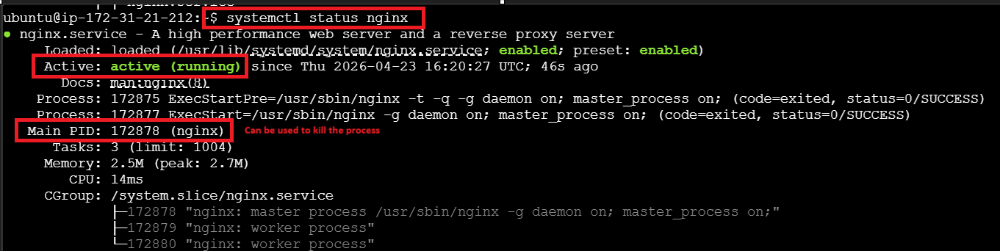
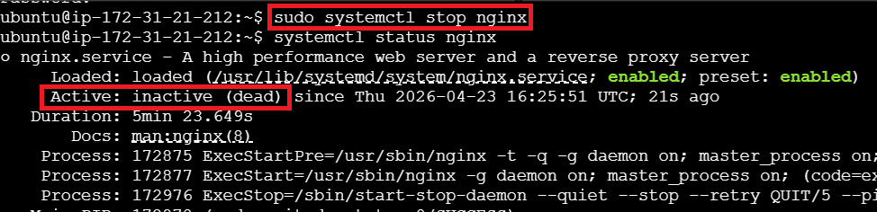
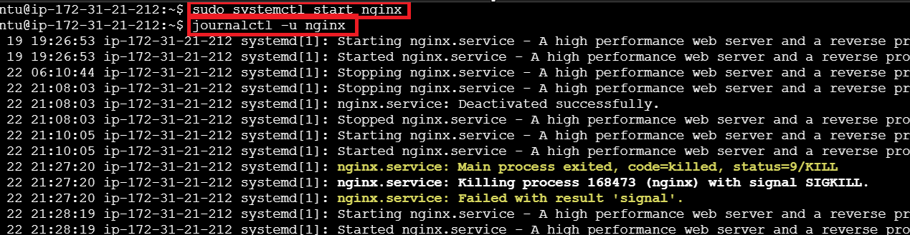
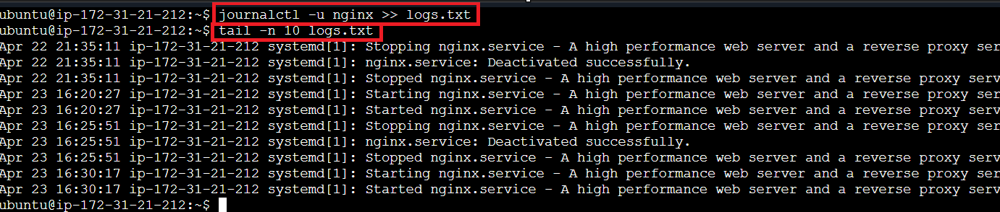

## Practicing Service Logs

### Installing the Service

#### Setting up the Test Environment
- **sudo apt-get update**: Install all the latest dependencies
- **sudo apt-get install nginx**: Install the nginx service/package
- **sudo apt-get install docker.io**: Install Docker

#### Uninstalling a Service
- **sudo apt-get remove docker.io**: Uninstall Docker

### Controlling the Service with systemd

**systemctl status nginx**

**systemctl stop nginx**

**systemctl start nginx** \
**ps -aux | grep nginx**  (To see all the running process associated with nginx)

**journalctl -u nginx** (To see logs of the service)

**journalctl -u nginx >> logs.txt** (To save the logs in the file)
**tail -n 10 logs.txt** (To see last 10 logs)

