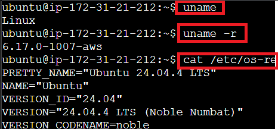
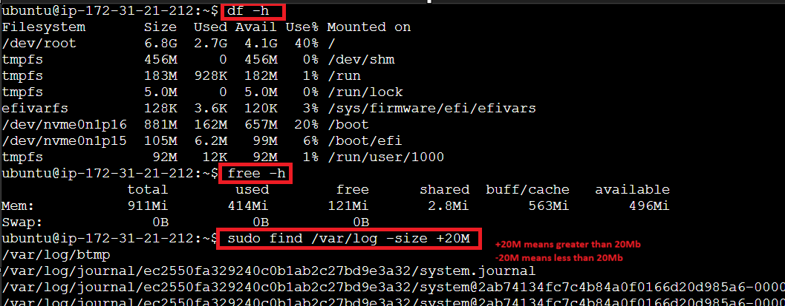
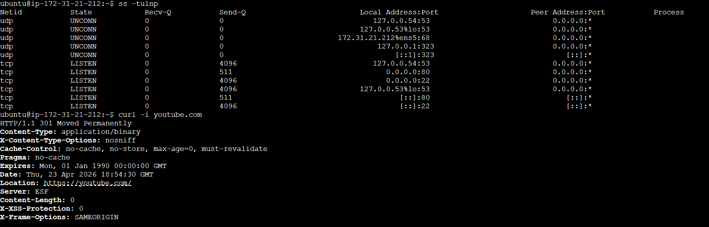
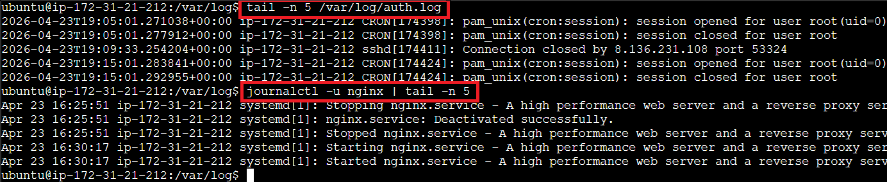

## Handbook for Linux Quick-Troubleshooting

### First get information about the Environment that you are working on

 - **uname** (OS name)
 - **uname -r**  (To see kernel version)
 - **cat /etc/os-release** (To see linux flavour)

### Create a throwaway folder for quick troubleshooting - to keep finds here
**mkdir /tmp/Investigate**

### Check computer health
 - **df -h** (check the harddisk storage)
if found high then see which file contains more space using find command/ ls -alt
sudo find / -size +10M (show file name whose size is greater than 10MB)
sudo find / -size -10M (show file name whose size is less than 10MB)
sudo du -ah | sort -rh | head -n 10 (gives top 10 biggest file/ folder on the Vm)

 - **free -h** (check the memory)
if found high then see which process taking more memory if not important process then kill it

 - **ps -aux/ htop** (grep command only works with ps NOT with top/htop)
 - **kill -9 PID** (To kill the process forcefully)

### Networking health check

 - **netstat -tulnp / ss -tulnp** (both are same) 
 - **ifconfig** (check ip address of current logged in machine)
 - **ping url** (check if we are able to contact website)
 - **curl -i url** (same as ping gives additional detail such as response code - 200, 301, etc)

### Logging

 - journalctl -u (servicename)
 - tail -n 50 /var/log/file.log

