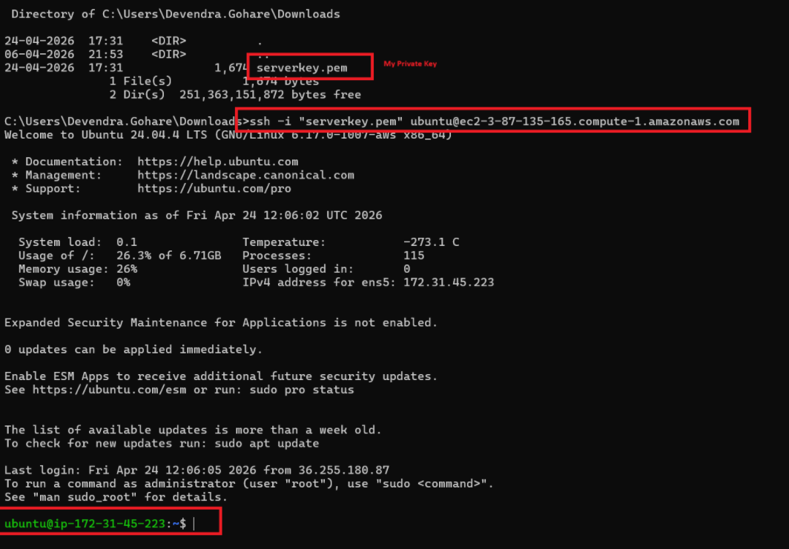
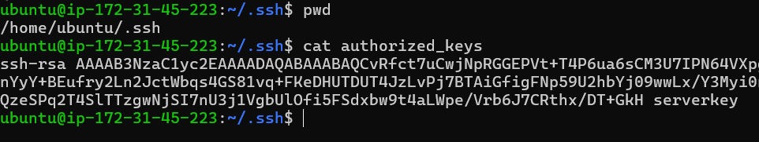
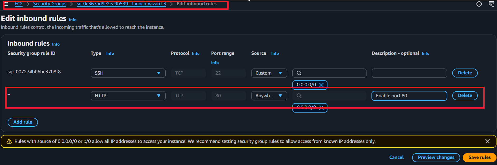
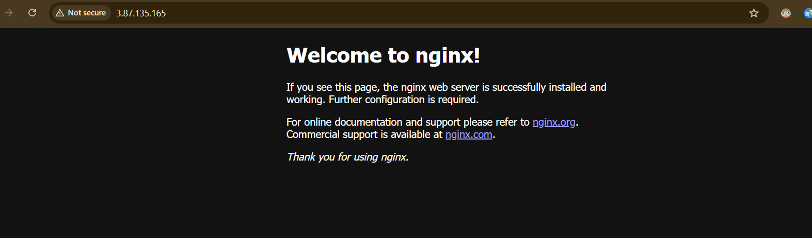
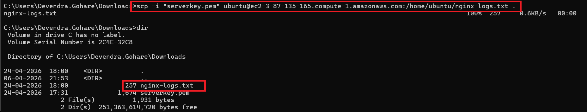

### Goals
- **Create a Linux VM on AWS**
- **Connect using SSH**
- **Enable port 80** so nginx can receive inbound HTTP traffic

### Environment Preparation
The VM was created manually on AWS.

Connected using SSH and downloaded the private key.



> Note: The public key is stored on the remote server in `/home/ubuntu/.ssh/authorized_keys`.



### Enable Port 80



### Install nginx on the VM
```bash
sudo apt-get update
sudo apt-get install nginx
```

Check its status:
```bash
systemctl status nginx
```

### Website Check: Working



> Note: If you cannot see the page, use `http://` instead of `https://` because port 80 listens on HTTP only.

### Download Log Files to Local Machine

The nginx log file was saved on the VM at:

- `/home/ubuntu/nginx-logs.txt`

Switch to the local machine terminal and run `scp` (secure copy):
**Syntax** scp -i (private-key) (source) (destination)
```bash
scp -i <privatekey> user@remote_ip:/path/to/remote/file /path/to/local/destination
```

**Example:**

```bash
scp -i "serverkey.pem" ubuntu@ec2-3-87-135-165.compute-1.amazonaws.com:/home/ubuntu/nginx-logs.txt .
```
**Note:** **. Means** copy to current working directory in local.



