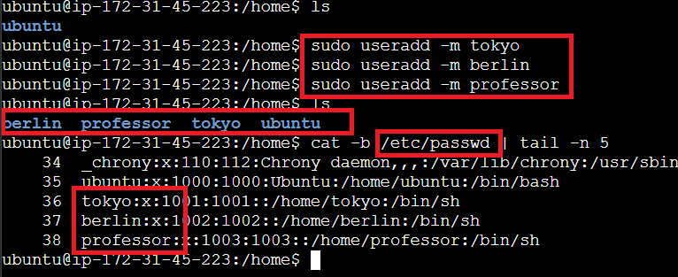
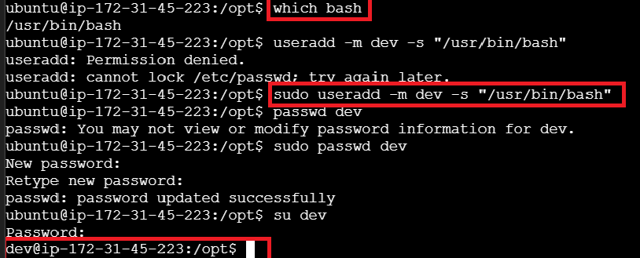
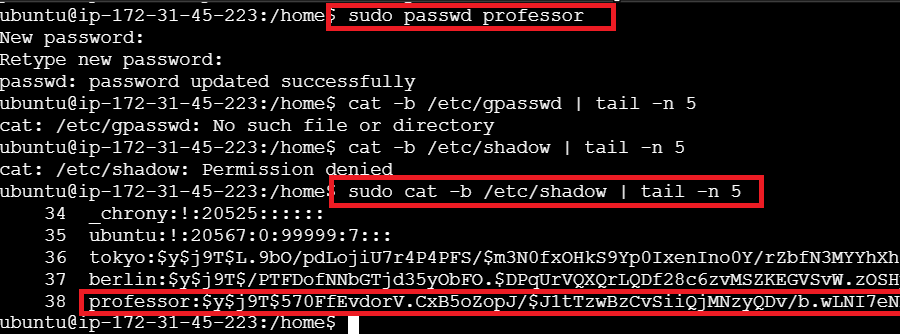
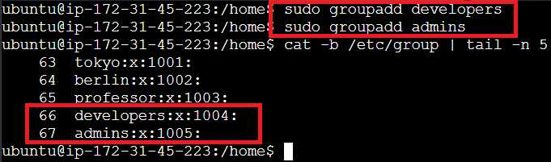
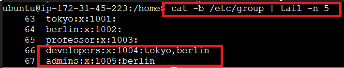
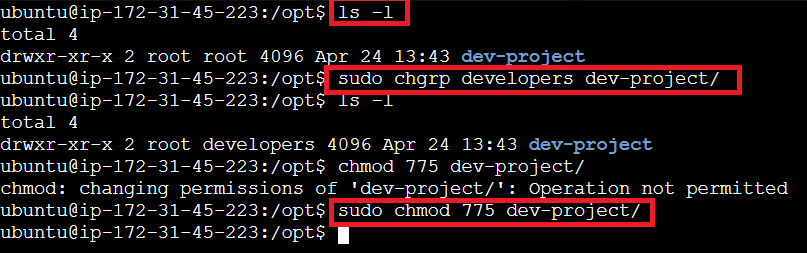

## Create Users/Groups

### Create a User with Home Directory
To create a user with a home directory, use the `-m` flag:

```bash
sudo useradd -m <username>
```



> **Note:** Use the `-s` parameter to specify the bash shell for the new user. To see the current bash shell, run `which bash`.



> **Note:** To verify if the user was added successfully, check the `/etc/passwd` file:

```bash
cat /etc/passwd
```

### Set Password for Users
To set a password for a user:

```bash
passwd <username>
```



> **Note:** To check the encrypted password, view the `/etc/shadow` file:

```bash
cat /etc/shadow
```

### Add Groups
To add a new group:

```bash
sudo groupadd <groupname>
```



> **Note:** To check encrypted group details, view the `/etc/gshadow` file:

```bash
cat /etc/gshadow
```

### Add a User to a Group
To add a single user to a group:

```bash
sudo gpasswd -a <username> <groupname>
```

To add multiple users to a group, use the `-M` flag with users separated by commas:

```bash
sudo gpasswd -M tokyo,berlin,professor <groupname>
```

### Check if Users Are Added to Group



### Changing File/Folder Permissions
- **chmod**: Set rwx permissions
- **chown**: Change file/directory owner
- **chgrp**: Change file/directory group owner
- **newgrp**: Refresh group membership; newly created files/folders will default to this group



### Switch to a Different User to Test Changes
To switch to another user:

```bash
su <username>
```

(Enter the password when prompted)

To verify the current user:

```bash
whoami
```

> **Note:** To switch to root, use `sudo su`. To exit, type `exit`.

### Task 4 (from README.md)
Tokyo and Berlin have access to the dev-project file and can create files since both are in the developers group.


