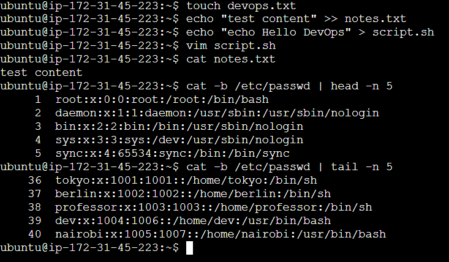

## Basic File Creation, Reading, and Editing



> **Note:** Always use **vim** instead of **nano** to follow better industry standards.
>
> - Press `i` to enter INSERT mode.
> - Press `Esc` + `:wq` to save and exit.
> - Press `Esc` + `:q` to exit without saving.

## Understanding File Permissions

In my personal opinion, we should not use numbers (like `chmod 777`) to assign file permissions. We should use the **ugo** method instead.

- **u** - user
- **g** - group
- **o** - others

### Examples

To assign read, write, and execute permissions to the user:

```bash
chmod u+rwx filename
```

To remove read and execute permissions from the user:

```bash
chmod u-rx filename
```

To assign permissions to user, group, and others at the same time:

```bash
chmod u+rwx,g+rwx,o-rwx notes.txt  # Same as chmod 770
chmod u+r,u-wx,g-rwx,o-rwx devops.txt
```

We can combine these to achieve the required permissions.

> **Note:** We need **x** (execute) permission to `cd` into a directory.