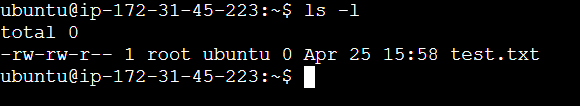
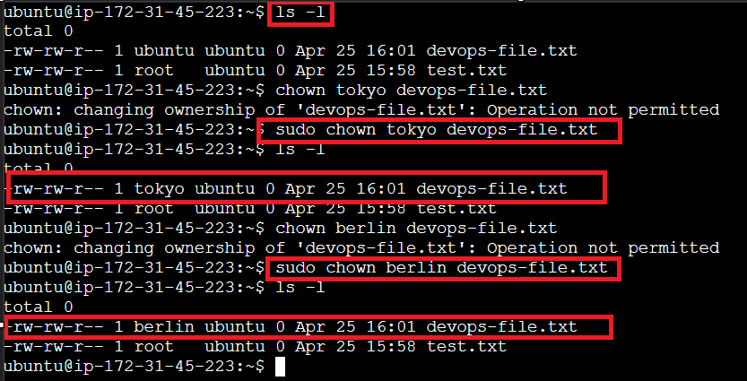
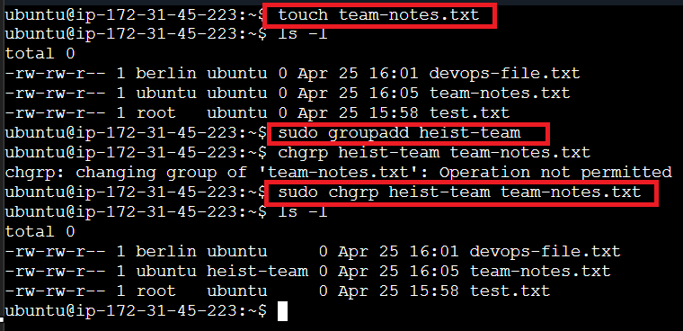
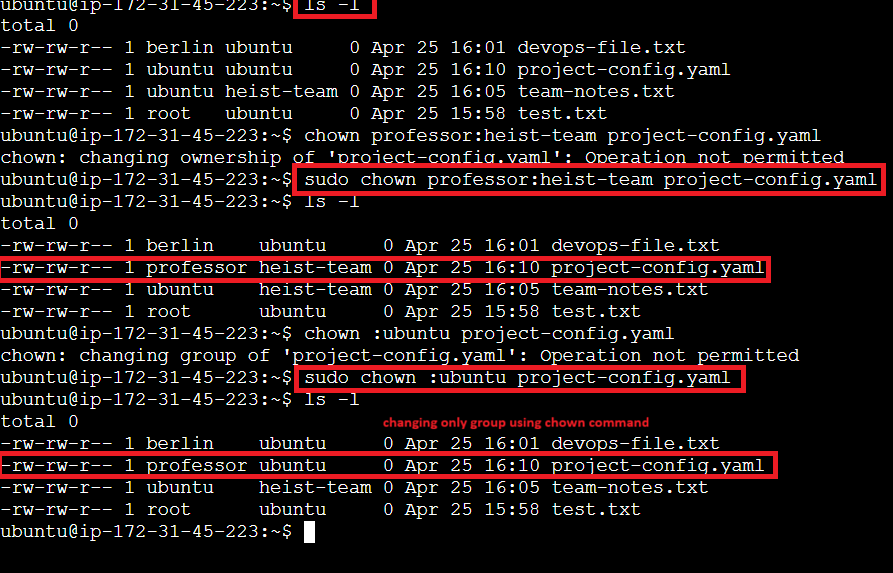
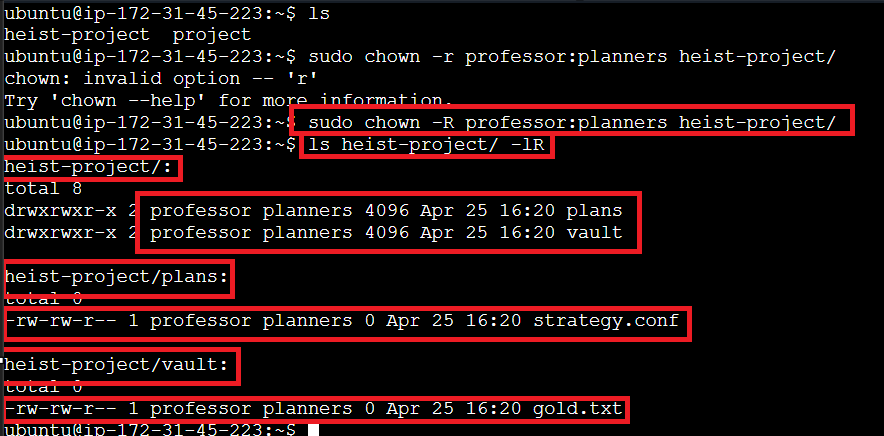

## Understanding File Ownership



> **Note:** `root` is the file owner and `ubuntu` is the group owner.

### Change the File Owner

Use the `chown` command to change the owner:

```bash
sudo chown <user> <filename>
```



### Change the Group Owner

Use `chown` to change only the group owner:

```bash
sudo chown :<group> <filename>
```



### Change Owner and Group Together

You can change both owner and group in a single command:

```bash
sudo chown <user>:<group> <filename>
```



### Recursive Ownership

To change ownership recursively for a directory and all its contents, use the `-R` flag:

```bash
sudo chown -R <user>:<group> <directory>
```



