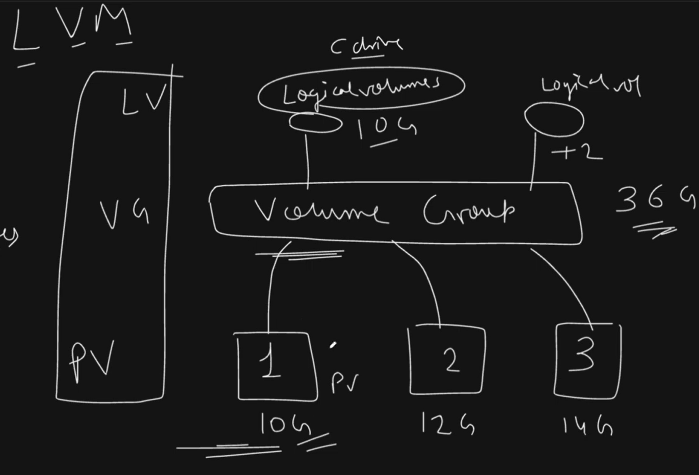
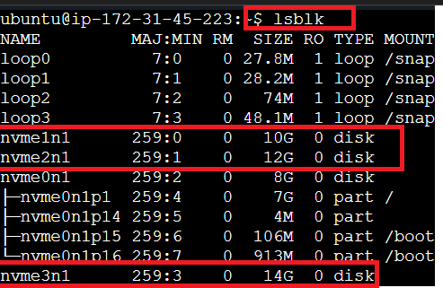
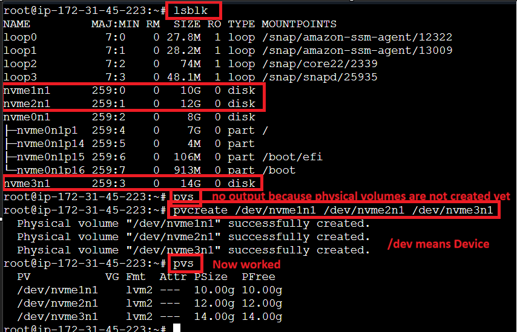
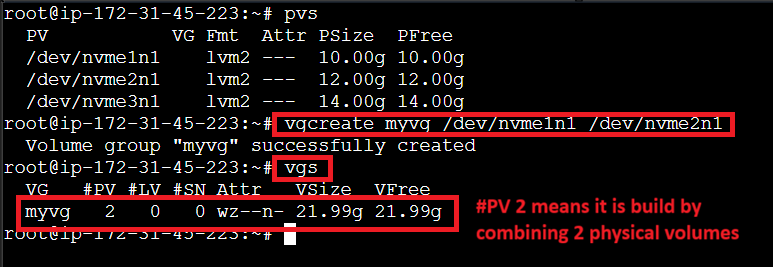
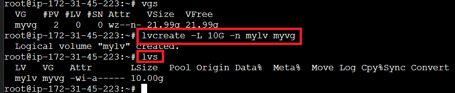
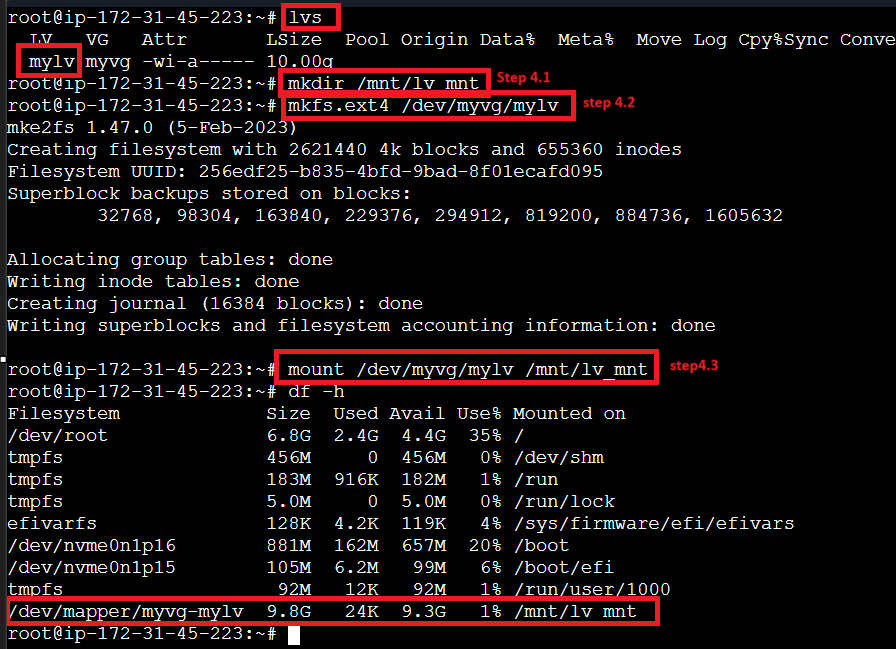
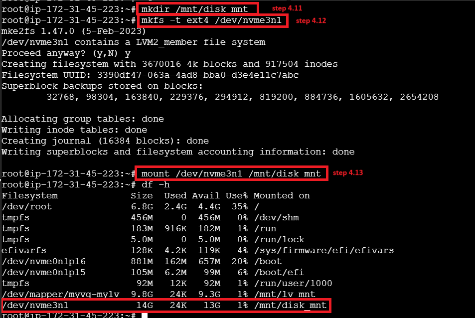

# Linux Volume Management



## Key Storage Commands
- **`lsblk`**: List all storage devices attached to the VM
- **`df -h`**: Show available and used mounted storage in human-readable format

> **Note:** On AWS, external storage volumes must be in the same Availability Zone as the VM.

## Attached Volumes
Three volumes were attached to the VM: **10 GB**, **12 GB**, and **14 GB**. These should appear in the `lsblk` output.



## Root Access for Volume Management
All volume management tasks should be performed as root:

```bash
sudo su
# or
sudo -i
```

## Step 1: Create Physical Volumes
Create physical volumes from block devices:

```bash
pvcreate /dev/disk1 /dev/disk2 ...
```

Inspect physical volumes:

```bash
pvs
pvdisplay
```



## Step 2: Create a Volume Group
Create a volume group using the desired physical volumes (for example, the 10 GB and 12 GB disks):

```bash
vgcreate <groupname> /dev/disk1 /dev/disk2
```

Inspect volume groups:

```bash
vgs
vgdisplay
```



## Step 3: Create a Logical Volume
Create a logical volume from the volume group:

```bash
lvcreate -L <size> -n <lv_name> <vg_name>
```

Example:

```bash
lvcreate -L 10G -n mylv myvg
```

Inspect logical volumes:

```bash
lvs
lvdisplay
```



## Step 4.0: Mount the Logical Volume (Dynamic Volume)
1. Create a mount point:

```bash
mkdir /mnt/lv_mnt
```

2. Format the logical volume:

```bash
mkfs.ext4 /dev/myvg/mylv
```

3. Mount the logical volume:

```bash
mount /dev/myvg/mylv /mnt/lv_mnt
```



> **Important:** This is a dynamic volume, so it can be resized.

Resize the volume:

```bash
lvextend -L +5G /dev/myvg/mylv
```

Then verify the change with:

```bash
lvs
lsblk
```

> Note: `df -h` may take longer to reflect the new size.

> **Warning:** Reducing volume size is more complex. You must unmount the volume, shrink it safely, then mount it again.

## Mount vs Attach
- **Attach**: The disk is connected to the VM
- **Mount**: The disk is made usable by binding it to a directory

> **Note:** Data remains on the disk even after unmounting.

To unmount the dynamic volume:

```bash
umount /mnt/lv_mnt
```

## Step 4.1: Mount a Physical/Disk Volume (Static Volume)
1. Create a mount point:

```bash
mkdir /mnt/disk_mnt
```

2. Format the disk volume:

```bash
mkfs -t ext4 /dev/nvme3n1
```

3. Mount the disk volume:

```bash
mount /dev/nvme3n1 /mnt/disk_mnt
```



To unmount the disk volume:

```bash
umount /mnt/disk_mnt
```

## Important Note
For automatic mounting after reboot, add the volume to `/etc/fstab` with this format:

```text
/dev/myvg/mylv   /mnt/lv_mnt   ext4   defaults   0 0
```

> If you do not add it to `/etc/fstab`, the volume will be unmounted after restart.


