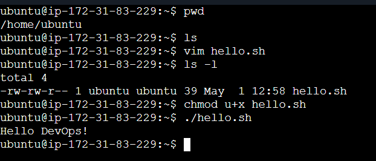
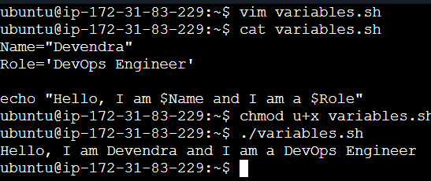
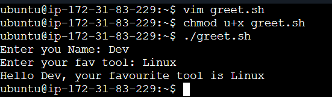

# Day 16 – Shell Scripting Basics

## Task 1: Your First Script

**Objective:** Create and execute your first shell script with a shebang line.

### Script: `hello.sh`

```bash
#!/bin/bash
echo "Hello DevOps!"
```

### Execution Steps

1. Create file: `vim hello.sh`
2. Add the code above
3. Save and exit: `:wq!`
4. Make executable: `chmod u+x hello.sh`
5. Run: `./hello.sh`

### Output



---

## Task 2: Variables

**Objective:** Learn how to use variables in shell scripts and understand quote differences.

### Script: `variables.sh`

```bash
#!/bin/bash
Name="Devendra"
Role="DevOps Engineer"

echo "Hello, I am $Name and I am a $Role"
```

### Execution Steps

1. Create file: `vim variables.sh`
2. Add the code above
3. Save and exit: `:wq!`
4. Make executable: `chmod u+x variables.sh`
5. Run: `./variables.sh`

### Key Learning

- **Double quotes** allow variable expansion: `"Hello $name"`
- **Single quotes** preserve literal values: `'$name' prints as $name`

### Output



---

## Task 3: User Input with `read`

**Objective:** Accept user input and use it in your script.

### Script: `greet.sh`

```bash
#!/bin/bash
read -p "Enter your Name: " name
read -p "Enter your favorite tool: " tool
echo "Hello $name, your favourite tool is $tool"
```

### Execution Steps

1. Create file: `vim greet.sh`
2. Add the code above
3. Save and exit: `:wq!`
4. Make executable: `chmod u+x greet.sh`
5. Run: `./greet.sh`

### Output



---

## Task 4: If-Else Conditions

**Objective:** Write scripts with conditional logic to check numbers and file existence.

### Script 1: `check_number.sh`

```bash
#!/bin/bash

# Take input from user
read -p "Enter the Number: " num

# Check the number
if [ "$num" -gt 0 ]; then
    echo "Positive Number"
elif [ "$num" -eq 0 ]; then
    echo "Zero"
else
    echo "Negative Number"
fi
```

### Script 2: `file_check.sh`

```bash
#!/bin/bash

# Input file name from user
read -p "Enter the file name: " file

if [ -f "$file" ]; then
    echo "File Found"
else
    echo "File Does not Exist"
fi
```

### Execution Steps for Both Scripts

1. Create files: `touch check_number.sh file_check.sh`
2. Make executable: `chmod u+x check_number.sh file_check.sh`
3. Edit each file with `vim` and add the code above
4. Run: `./check_number.sh` or `./file_check.sh`

### Key Learning

- Brackets `[ ]` are required in if conditions
- `[ -f filename ]` checks if file exists
- `[ -d dirname ]` checks if directory exists
- `-gt` means "greater than", `-eq` means "equal to"

---

## Task 5: Combine It All

**Objective:** Create a script that combines variables, user input, and conditions to check service status.

### Script: `server_check.sh`

```bash
#!/bin/bash

read -p "Enter the Name of Service: " service

read -p "Do you want to check the status of the service? [y/n] " flag

if [ "$flag" = "y" ]; then
    systemctl status $service
else
    echo "Skipped."
    exit 1
fi
```

### Execution Steps

1. Create file: `vim server_check.sh`
2. Add the code above
3. Save and exit: `:wq!`
4. Make executable: `chmod u+x server_check.sh`
5. Run: `./server_check.sh`

---

## Key Learning Points

1. **Shebang (`#!/bin/bash`)** — Tells the system which interpreter to use
2. **Variables** — Store data with `NAME="value"` (no spaces around `=`)
3. **User Input** — Use `read -p "prompt" variable` to get input
4. **Conditionals** — Use `if [ condition ]; then ... fi` structure
5. **File Testing** — `-f` checks files, `-d` checks directories
6. **Quote Differences** — Double quotes allow variable expansion, single quotes don't

---

## Summary

You've learned the fundamentals of shell scripting:
- Creating executable scripts with proper shebang
- Working with variables and user input
- Making decisions with if-else logic
- Testing file and directory existence
- Building practical scripts that combine multiple concepts


