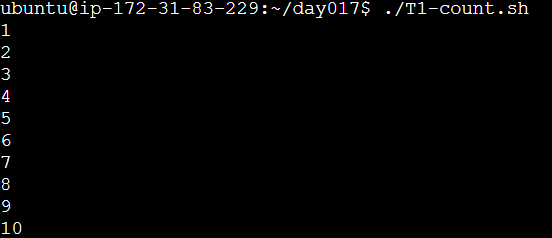
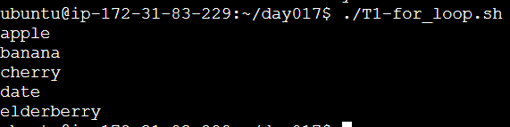
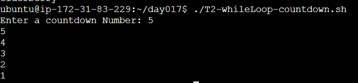
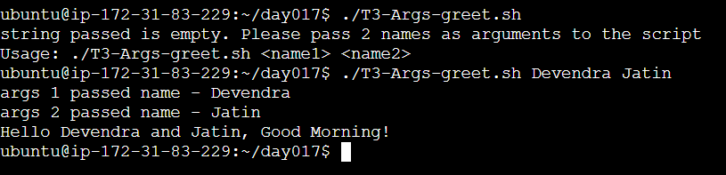
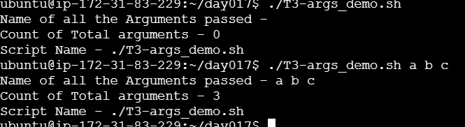
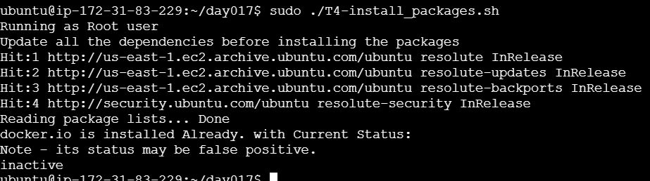
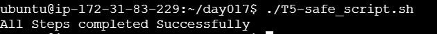

### Task 1: For Loop
Refer Script - T1-count.sh
touch T1-count.sh; chmod u+x T1-count.sh
Output of Command:

Refer Script - T1-for_loop.sh
touch T1-for_loop.sh; chmod u+x T1-for_loop.sh
Output of Command:

### Task 2: While Loop

Refer Script - T2-whileLoop-countdown.sh
touch T2-whileLoop-countdown.sh; chmod u+x T2-whileLoop-countdown.sh
Output of Command:

### Task 3: Command-Line Arguments

Refer Script - T3-Args-greet.sh
touch T3-Args-greet.sh; chmod u+x T3-Args-greet.sh
Output of Command:

Refer Script - T3-args_demo.sh
touch T3-args_demo.sh; chmod u+x T3-args_demo.sh
Output of Command:

### Task 4: Install Packages via Script

Refer Script - T4-install_packages.sh
touch T4-install_packages.sh; chmod u+x T4-install_packages.sh
Output of Command:

### Task 5: Error Handling

Refer Script - T5-safe_script.sh
touch T5-safe_script.sh; chmod u+x T5-safe_script.sh
Output of Command:

