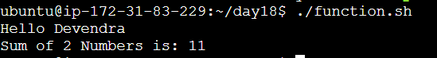
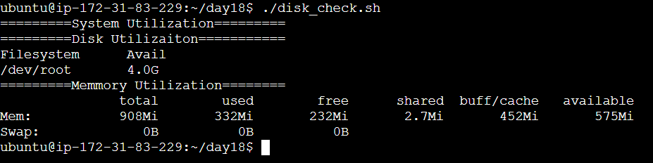
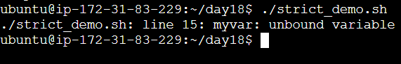
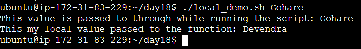
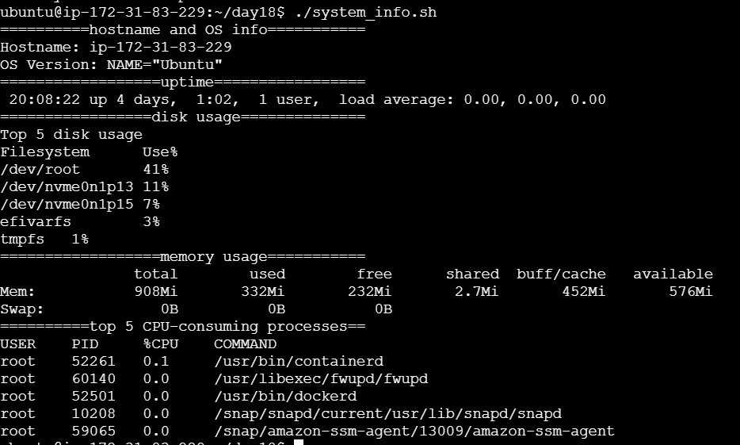

# Day 18 – System Information Scripts

## Task 1: Basic Functions
**Script:** `T1-functions.sh`

### Notes
- Create the script and make it executable: `touch T1-functions.sh && chmod u+x T1-functions.sh`
- Execute the script to see basic function usage.

### Output

---

## Task 2: Functions with Return Values
**Script:** `T2-disk_check.sh`

### Notes
- Create the script and make it executable: `touch T2-disk_check.sh && chmod u+x T2-disk_check.sh`
- Run the script to verify return values and disk checks.

### Output

---

## Task 3: Strict Mode — `set -euo pipefail`
**Script:** `T3-strict_demo.sh`

### Notes
- Create the script and make it executable: `touch T3-strict_demo.sh && chmod u+x T3-strict_demo.sh`
- The script demonstrates safer execution using strict mode.

### Output

---

## Task 4: Local Variables
**Script:** `T4-local_demo.sh`

### Notes
- Create the script and make it executable: `touch T4-local_demo.sh && chmod u+x T4-local_demo.sh`
- Run it to see how local variable scope works inside functions.

### Output

---

## Task 5: Build a Script — System Info Reporter
**Script:** `T5-system_info.sh`

### Notes
- Create the script and make it executable: `touch T5-system_info.sh && chmod u+x T5-system_info.sh`
- This script combines functions and system checks to produce a summary report.

### Output

