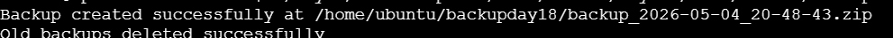
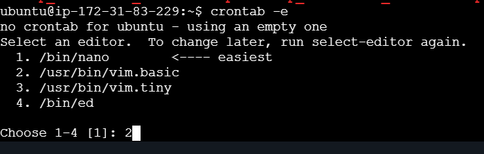
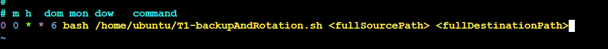

# Day 19 – Log Backup and Rotation Project

## Task 1: Backup and Log Rotation Script

**Objective:** Create a script to backup logs and implement rotation.

**Script:** `T1-backupAndRotation.sh`

### Execution Steps

1. Create the script: `touch T1-backupAndRotation.sh`
2. Make it executable: `chmod u+x T1-backupAndRotation.sh`
3. Run the script to perform backup and rotation.

```bash
#!/bin/bash

set -e

<< notice

This script take backup of files for 5 days rotation.
useage:
./new.sh <path_source_directory> <path_backup_directory>
Ensure zip is installed on the system before running the script. You can install it by running "sudo apt install zip" command on Ubuntu or "sudo yum install zip" command on CentOS.

notice

if [ $# -ne 2 ]; then
        echo "Please provide source and backup directory as arguments to the script"
        echo "Usage: ./new.sh <path_source_directory> <path_backup_directory>"
        exit 1
fi

source_dir=$1
time=$(date +%Y-%m-%d_%H-%M-%S)
backup_dir=$2


back()
{
    mkdir -p $backup_dir
    zip -r $backup_dir/backup_$time.zip $source_dir > /dev/null
    echo "Backup created successfully at $backup_dir/backup_$time.zip"  

}

back

rotate()
{   
    cd $backup_dir
    backups=($(ls -t *.zip))   # takes all the zip files in the backup directory and sort them by time in descending order. The most recent backup will be at the beginning of the array. 
    # echo "${backups[@]}"   - to print all the files in the backup directory 
    
    if [ "${#backups[@]}" -gt 5 ]; then   # checks if the number of backup files is greater than 5. If it is, it means we have more than 5 backups and we need to delete the older ones.

        file_to_delete=("${backups[@]:5}")  # creates an array called file_to_delete that contains the backup files starting from the 6th file (index 5) to the end of the array. This means that the first 5 files (the most recent backups) will be excluded from this array, and only the older backups will be included for deletion.
    
        for file in "${file_to_delete[@]}"; do
            rm "$file"
        done

    echo "Old backups deleted successfully"
    else
        echo "No old backups to delete. Total backups: ${#backups[@]}"
    fi
}

rotate
```

### Output



---

## Task 2: Crontab Setup

**Objective:** Schedule the backup script to run automatically using cron.

### Steps to Configure Crontab

1. Open crontab editor: `crontab -e`
2. Select editor option 2 (nano or your preferred editor)
3. Add the cron expression for weekly execution at 00:00 on Saturday:
   ```
   0 0 * * 6 /path/to/T1-backupAndRotation.sh
   ```
4. Save and exit: `:wq!`

### Cron Expression Details

- **Expression:** `0 0 * * 6`
- **Meaning:** Runs at 00:00 (midnight) every Saturday
- **Tip:** Use [crontab.guru](https://crontab.guru) to generate and verify cron expressions.

### Verification

- Check your crontab entries: `crontab -l`

### Screenshots

- Crontab editor interface:


- Cron expression added:


---

## Summary

This project demonstrates:
- Creating automated backup scripts with log rotation
- Scheduling tasks using cron for regular maintenance
- Best practices for system administration scripts

