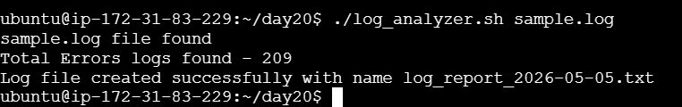

### Pre-requisites

Create a sample log file using sample_logs_generator.sh
vim sample_logs_generator.sh
chmod u+x sample_logs_generator.sh 
./sample_logs_generator.sh /home/ubuntu/day20/sample.log 1000

### Task 1: Input and Validation

# check if argument passed is empty or not
if [ -z $1 ] \
then \
                echo "No argument is passed. please pass an argument" \
                echo "Useage - $0 <logfilepath>" \
                exit 1 \
fi 

if [ -f $1 ] \
then \
        echo "$1 file found" \
        file=$1 \
else \
        echo "file does not exists. please file a valid file path" \
        exit 1 \
fi

### Task 2: Error Count

# Count the number of error logs in the file

count_errors=$( cat $file | awk '/ERROR/ || /Failed/' | wc -l ) \
echo "Total Errors logs found - $count_errors" \

### Task 3: Critical Events

awk '/CRITICAL/ { print "Line--" NR ": " $0 }' $file \

### Task 4: Top Error Messages
awk '/ERROR/ { print $0 }' sample.log | uniq -c | sort -k1 -r | head -n 5 \

### Task 5: Summary Report

See the full code in log_analyzer.sh. \

{ \
echo "===== Log Analysis Report =====" \
echo "Date of Analysis : $(date)" \
echo "Log File         : $0" \
echo "Total Lines      : $total_lines" \
echo "Total ERRORs     : $error_count" \

echo "" \
echo "----- Top 5 Error Messages -----" \
echo "$top_error" \
\
echo "" \
echo "----- Critical Events -----" \
echo "$critical" \
 
} > "/home/ubuntu/day20/log_report_$(date +%Y-%m-%d).txt" \

