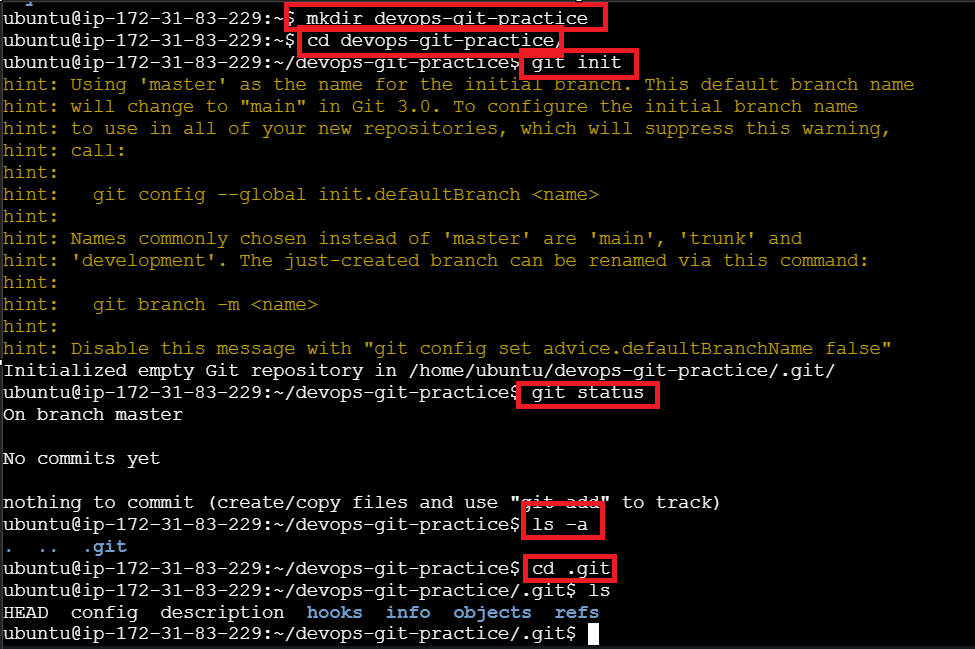
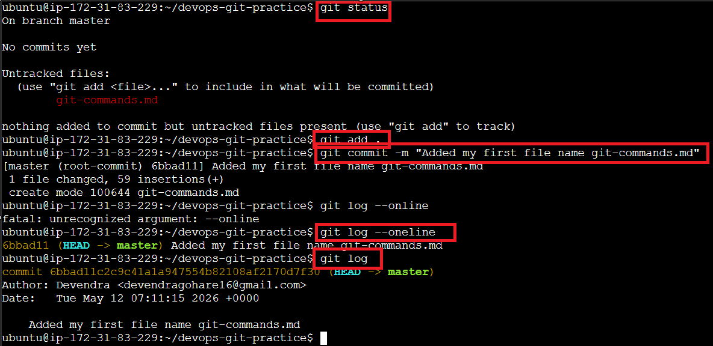
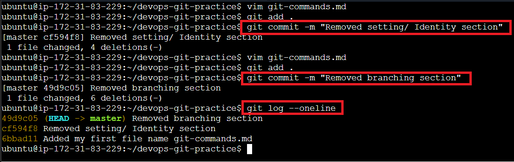

# Day 22 - Git Basics & Workflow

## Challenge Tasks

### Task 1: Install and Configure Git

Commands used:
```bash
git --version
git config --global user.name "Devendra"
git config --global user.email "devendrgohare16@gmail.com"
git config --list
```


### Task 2: Create Your Git Project



### Task 3: Create Your Git Commands Reference

Created a file `git-commands.md` with contents of git command reference file in the repo that I created locally in a Linux EC2 instance.

### Task 4: Stage and Commit



### Task 5: Make More Changes and Build History



### Task 6: Understand the Git Workflow

Answers to key Git workflow questions:

#### 1. What is the difference between `git add` and `git commit`?

`git add` sends files to the staging area, while `git commit` creates log entries with hash values that capture file versions. `git add` prepares files for commit, and `git commit` records them permanently in the Git history.

#### 2. What does the **staging area** do? Why doesn't Git just commit directly?

The staging area allows you to select which files need to be committed. This provides flexibility to:
- Commit only relevant changes
- Review changes before committing
- Organize logical groups of changes

Direct commits would not allow selective file inclusion.

#### 3. What information does `git log` show you?

`git log` displays the history of all commits with details including:
- Commit hash/ID
- Author name and email
- Commit date and time
- Commit message
- Change history that can also be viewed on GitHub

#### 4. What is the `.git/` folder and what happens if you delete it?

The `.git/` folder stores all important Git information used to manage version control (commits, branches, history, etc.). Deleting `.git/` does NOT delete your actual project files—it only removes Git tracking and history, which cannot be recovered.

#### 5. What is the difference between a **working directory**, **staging area**, and **repository**?

- **Working Directory**: The folder/directory you're currently in. You can view it using `pwd`. This is where you edit files.
- **Staging Area**: Selects the files that need to be committed. Files are moved here using `git add`.
- **Repository**: A folder containing the `.git` file. Created using `git init` command. Stores all Git history and metadata.