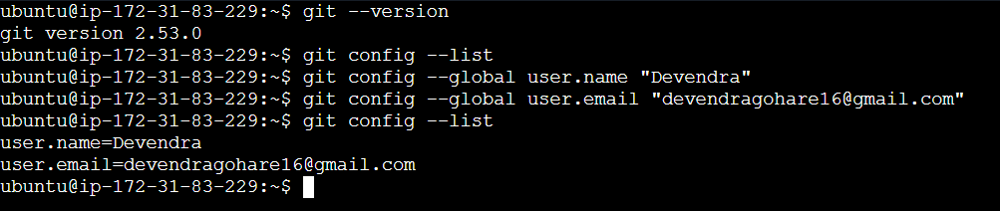

## Challenge Tasks

### Task 1: Install and Configure Git

Command used:
    git --version
    git config --global user.name "Devendra"
    git config --global user.email "devendrgohare16@gmail.com"
    git config --list

### Task 2: Create Your Git Project

### Task 3: Create Your Git Commands Reference

Created a file git-commands.md and pasted contents of my git command file in the repo that I created locally in linux EC2 instance

### Task 4: Stage and Commit

### Task 5: Make More Changes and Build History

### Task 6: Understand the Git Workflow
Answer these questions in your own words (add them to a `day-22-notes.md` file):
1. What is the difference between `git add` and `git commit`?
    Ans-1 - git add sends files to staging area while git commit creates log/ hash values that captures file versions

2. What does the **staging area** do? Why doesn't Git just commit directly?
    Ans-2 - staging area selects the files which needed to be get commited. 

3. What information does `git log` show you?
    Ans-3 - Gives the history of all the commit logs with details of users when commited them and we can also see the change history in github

4. What is the `.git/` folder and what happens if you delete it?
    Ans-4 - it stores the all the importand information which is used to manage the VCS. Deleting .git/ does NOT delete your actual project files. It only removes Git tracking/history (We cannot recover it again).

5. What is the difference between a **working directory**, **staging area**, and **repository**?
    Ans-5 - Working directory - folder/ directly we are currently on. we can see it using pwd.
            staging area - staging area selects the files which needed to be get commited.
            repository - A folder which contain .git file. can be created using git init command.