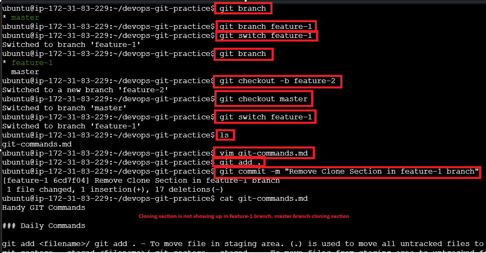
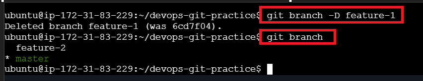
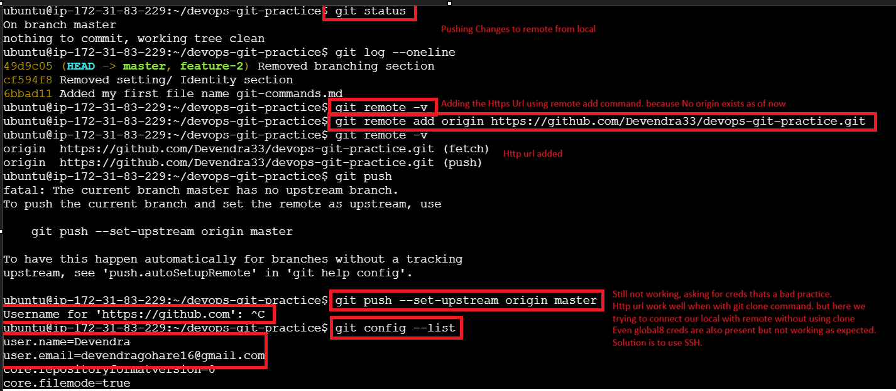
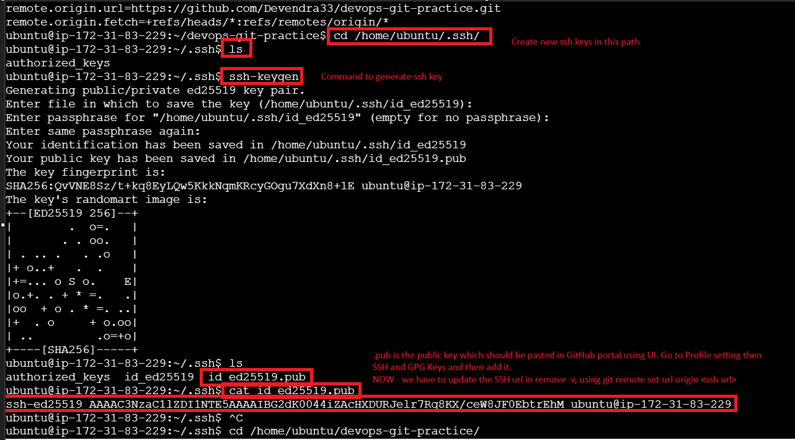
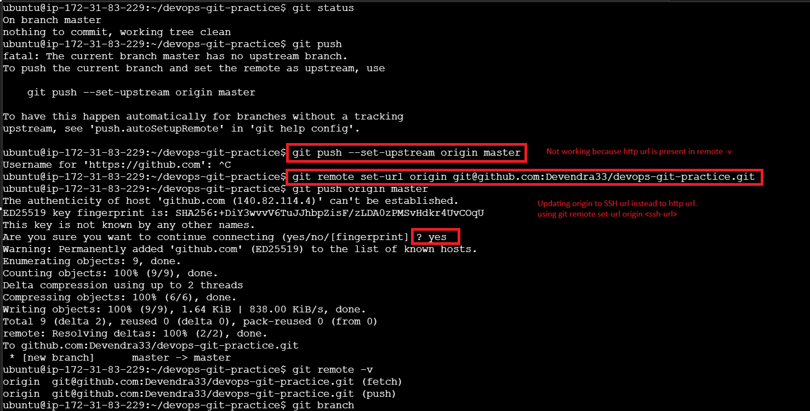

# Day 23 Notes - Understanding Branches

## Task 1: Understanding Branches

### 1. What is a branch in Git?

A branch in Git is an independent line of development. It allows developers to work on new features, bug fixes, or experiments without affecting the main project code.

Each branch has its own commits and changes. The default branch is usually called `main`.

### 2. Why do we use branches instead of committing everything to `main`?

We use branches to:

- Keep the `main` branch stable and production-ready.
- Develop features independently.
- Fix bugs safely.
- Allow multiple developers to work simultaneously.
- Test new ideas without affecting the main codebase.

Using branches helps maintain clean and organized development workflows.

### 3. What is `HEAD` in Git?

`HEAD` is a pointer that refers to the current branch or commit you are working on.

Normally, `HEAD` points to the latest commit of the active branch.

Example:

`HEAD -> main`

### 4. What happens to your files when you switch branches?

When you switch branches, Git updates the working directory files to match the state of the target branch.

- Files that exist in the target branch appear.
- Files not present in the target branch disappear.
- Modified versions of files may change.

## Task 2: Branching Commands — Hands-On

In your `devops-git-practice` repo, perform the following tasks.

Delete the branch:

## Task 3: Push to GitHub

Try to connect the local Git repo to a remote repository.

### Using HTTPS URL

### Using SSH URL

### 4. What is the difference between `origin` and `upstream`?

- **origin**: Your own repository or fork.
- **upstream**: The original repository from which you forked.

**Example Workflow**

- You fork a repository from an organization.
- Your fork is `origin`.
- The original repository is `upstream`.
- Push your changes to `origin`.
- Pull the latest updates from `upstream`.

## Task 4: Pull from GitHub

### What is the difference between `git fetch` and `git pull`?

- **`git fetch`**: Retrieves information about commits and branches from the remote repository without changing your local files. After fetching, you can inspect remote changes and switch to any new branch.
- **`git pull`**: Fetches and automatically merges remote changes into your local branch. It is effectively `git fetch` followed by `git merge`.

## Task 5: Clone vs Fork

1. **Clone** any public repository from GitHub to your local machine.
2. **Fork** the same repository on GitHub, then clone your fork.

### What is the difference between clone and fork?

- **Clone**: Downloads a copy of a remote repository to your local machine.
- **Fork**: Creates a copy of the repository in your own GitHub account.

### When would you clone vs fork?

- Use `git clone <http-url-of-repo>` when you want a local copy of a repository.
- Use fork when you want your own copy on GitHub, usually before contributing to someone else's repository.

### How do you keep your fork in sync with the original repo?

- Use the GitHub UI sync button.
- Alternatively, set the original repository as `upstream` and pull updates from it regularly.
