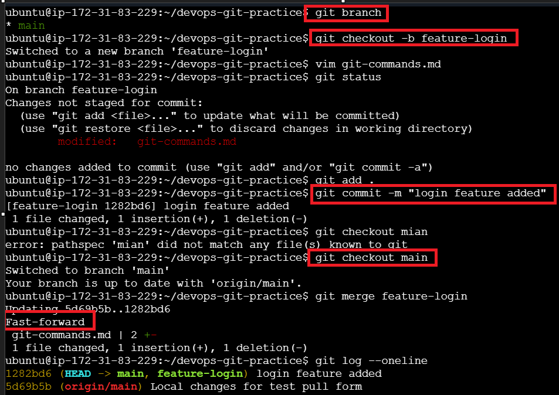
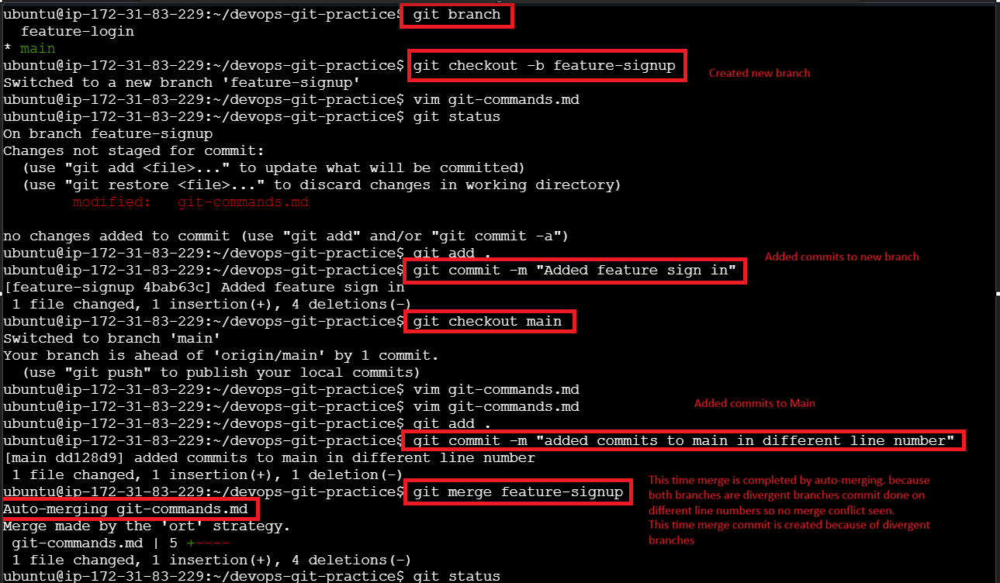
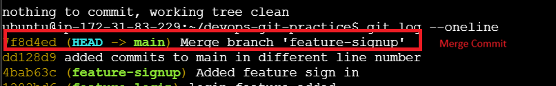
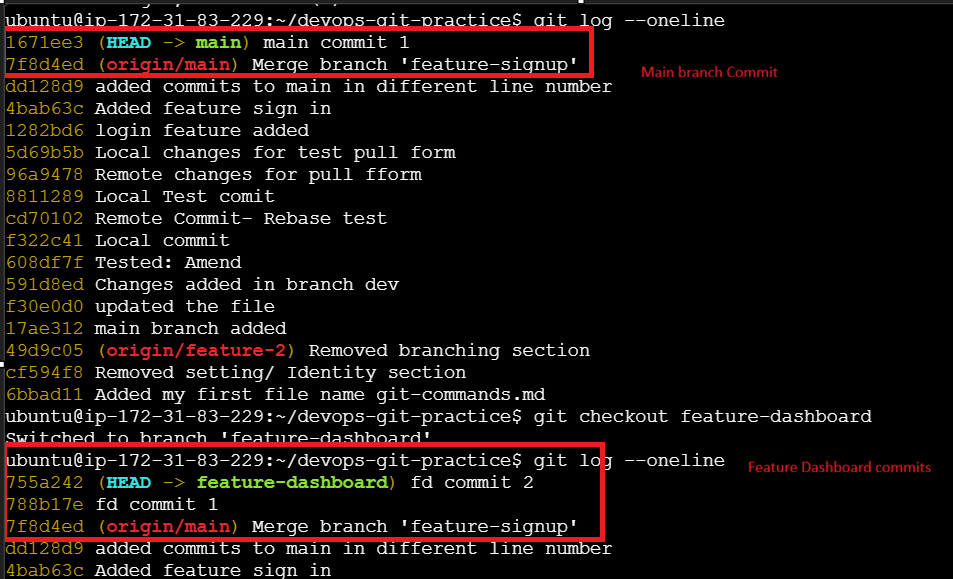
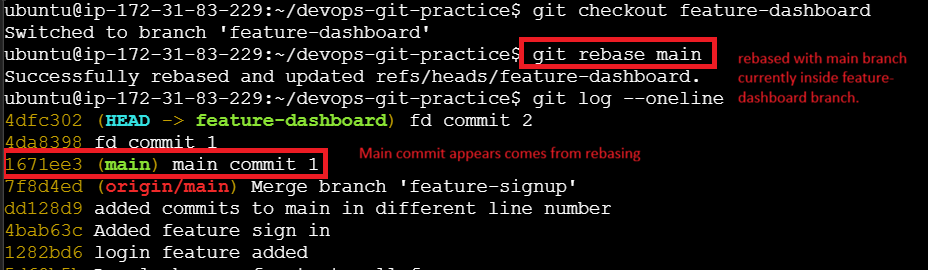
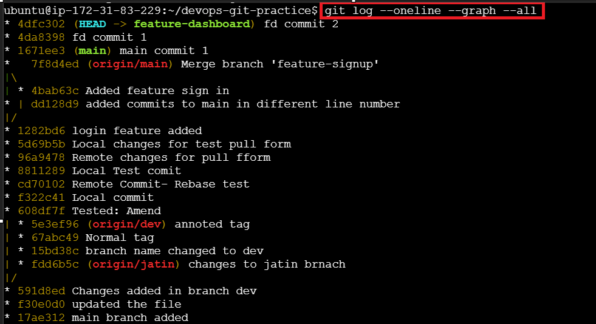
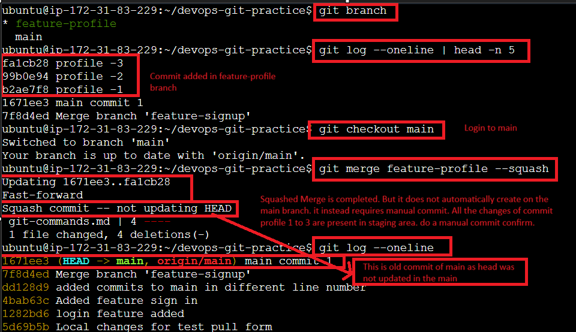
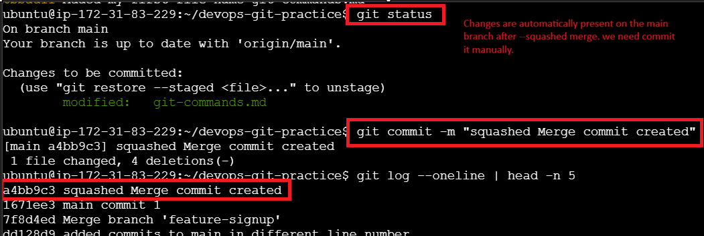
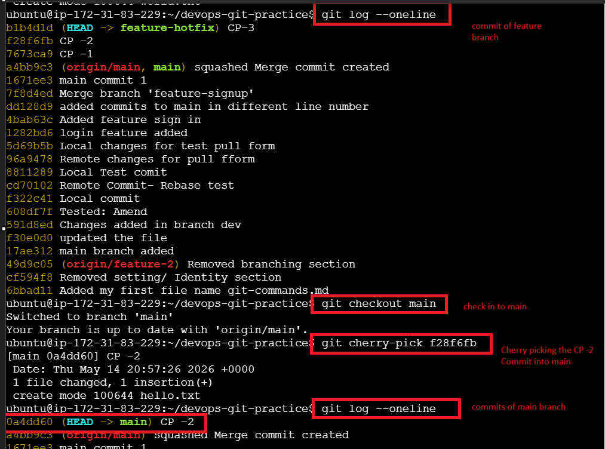

## Task 1: Git Merge — Hands-On
1. Create a new branch `feature-login` from `main`, add a couple of commits to it
2. Switch back to `main` and merge `feature-login` into `main`
3. Observe the merge — did Git do a **fast-forward** merge or a **merge commit**? (Only observed Fast-forward)

4. Now create another branch `feature-signup`, add commits to it — but also add a commit to `main` before merging
    5. Merge `feature-signup` into `main` — what happens this time?

Answers - I have created feature-signup branch. made commit there and also made commits in the main branch as-well.

6. Answer in your notes:
   - What is a fast-forward merge?
    Ans - Merge done on non-divergent branches - No merge commit will be created
   
   - When does Git create a merge commit instead?
    Ans - Merge done on divergent branches - merge commit will be created

   - What is a merge conflict? (try creating one intentionally by editing the same line in both branches)
    Ans - Merge Conflict occur when 2 branches have edit on same file with same line number.

## Task 2: Git Rebase — Hands-On
1. Create a branch `feature-dashboard` from `main`, add 2-3 commits
2. While on `main`, add a new commit (so `main` moves ahead)

3. Switch to `feature-dashboard` and rebase it onto `main`

4. Observe your `git log --oneline --graph --all` — how does the history look compared to a merge?

5. Answer in your notes:
   - What does rebase actually do to your commits?
    Ans - it make commit of divergent branches in the single line (linear fashion).
 
   - How is the history different from a merge?
    Ans - Commit are shown in the sequence. Not an actual merge
 
   - Why should you **never rebase commits that have been pushed and shared** with others?
    Ans - messes up the commits arrangement as it do not keep/ Preserves branch history.
 
   - When would you use rebase vs merge?
    Ans - rebase is used to take the latest changes from the source branch (when branches diverged)
          merge is used to merge the changes of 1 branch to another branch.

## Task 3: Squash Commit vs Merge Commit

1. Create a branch `feature-profile`, add 4-5 small commits (typo fix, formatting, etc.)
2. Merge it into `main` using `--squash` — what happens?
3. Check `git log` — how many commits were added to `main`?

4. Now create another branch `feature-settings`, add a few commits
5. Merge it into `main` **without** `--squash` (regular merge) — compare the history
   Ans - It add all the commits as it is when merged. 
6. Answer in your notes:
   - What does squash merging do?
    Ans - Converting multiple commits into a single commit.

   - When would you use squash merge vs regular merge?
    Ans - Regular Merge - You Want Full History.
          Squash Merge - You do not Want Full History.
  
   - What is the trade-off of squashing?
    Ans - You get a cleaner history, but lose detailed commit history.

## Task 4: Git Stash — Hands-On

Refer - D:\DevOpsTrain\90DaysOfDevOps\2026\day-22-gitBasics\git-commands.md (Stashing) section Easy concept.

**`git stash`**
Hides the current directory work of a branch. and we can switch to another branch to work on without adding or commiting the changes.

**`git stash list`**
list all the stashs.

**`git stash pop`**
Restores the hidden work of the branch. No copy remains in stashing stack.

**`git stash apply`**
Restores the hidden work of the branch. also 1 copy of stash is remain in the stashing stack.

**`git stash clear`**
delete the stash entry. all the entries

**`git stash drop`**
delete the stash entry. only the latest stash entry.

### Task 5: Cherry Picking
1. Create a branch `feature-hotfix`, make 3 commits with different changes
2. Switch to `main`
3. Cherry-pick **only the second commit** from `feature-hotfix` onto `main`
4. Verify with `git log` that only that one commit was applied

5. Answer in your notes:
   - What does cherry-pick do?
     Ans - git cherry-pick copies a specific commit from one branch and applies it onto another branch. It allows you to bring selected commits without merging the entire branch.

   - When would you use cherry-pick in a real project?
     Ans - Cherry-pick is useful when you only need specific changes from another branch.

   - What can go wrong with cherry-picking?
     Ans - if the target branch already changed the same lines, conflicts may occur during cherry-pick.