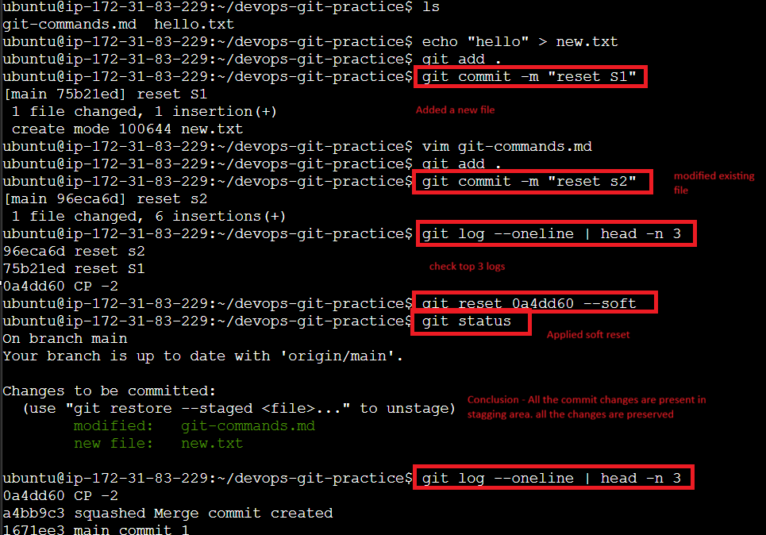
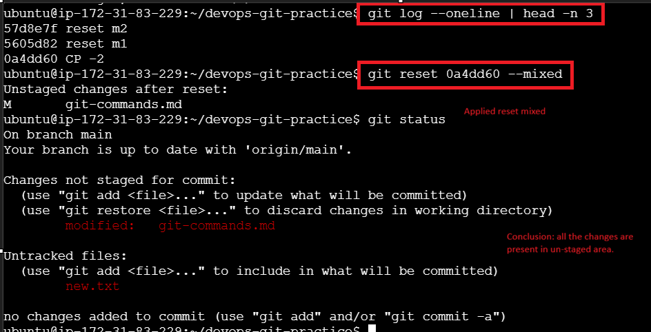
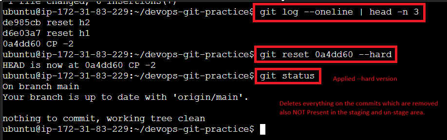

# Day 25 Notes - Advanced Git: Reset and Revert

## Task 1: Git Reset — Hands-On

1. Make 3 commits in your practice repo (`commit A`, `commit B`, `commit C`).
2. Use `git reset --soft` to go back one commit — what happens to the changes?

3. Re-commit, then use `git reset --mixed` to go back one commit — what happens now?

_(Default behaviour if no flag is passed)_

4. Re-commit, then use `git reset --hard` to go back one commit — what happens this time?

## Notes

### What is the difference between `--soft`, `--mixed`, and `--hard`?

| Reset Type | Commit History | Staging Area | Working Directory |
|---|---|---|---|
| `--soft` | Reset to previous commit | Keeps changes staged | Keeps file changes |
| `--mixed` (default) | Reset to previous commit | Unstages changes | Keeps file changes |
| `--hard` | Reset to previous commit | Removes staged changes | Deletes file changes |

### Which one is destructive and why?

- `--hard` is destructive because it permanently deletes working directory changes and unstaged file edits.

### Should you ever use `git reset` on commits that are already pushed?

- Usually **No** for shared branches.
- `git reset` rewrites commit history.
- If commits were already pushed and others pulled them:
  - history mismatch occurs
  - teammates may face conflicts
  - a force push may become necessary

## Task 2: Git Revert — Hands-On

1. Make 3 commits (`commit X`, `commit Y`, `commit Z`).
2. Revert commit Y (the middle one) — what happens?

- Answer: Git creates a new revert commit that undoes the changes from commit Y.
- Example: `git revert <commit-id> --no-edit`

3. Check `git log` — is commit Y still in the history?

- Yes, the original commit Y remains in history, and a new revert commit is added above it.

### Revert vs Reset

- `git revert` creates a new commit that undoes the changes of a previous commit.
- `git reset` moves the branch pointer backward and can remove commits from history.

| Feature | `git revert` | `git reset` |
|---|---|---|
| Removes commits from history | ❌ No | ✅ Yes |
| Creates a new commit | ✅ Yes | ❌ Usually no |
| Rewrites commit history | ❌ No | ✅ Yes |
| Safe for shared branches | ✅ Yes | ⚠️ Risky |
| Keeps project history intact | ✅ Yes | ❌ No |

### Why is revert safer than reset for shared branches?

- `git revert` preserves history and adds a corrective commit instead of rewriting history.
- It avoids disrupting other collaborators who have already pulled the branch.

### When would you use revert vs reset?

- Use **revert** when you need to undo a commit on a shared branch or preserve history.
- Use **reset** when you are rewriting local history, cleaning up work, or undoing commits before pushing.

## Task 3: Branching Strategies

### 1. GitFlow

**How it works:**
- GitFlow uses multiple permanent branches: `main`, `develop`, and supporting branches for features, releases, and hotfixes.
- Developers create feature branches from `develop` and merge them back into `develop`.
- Release branches are created from `develop` for final testing and preparation.
- Hotfix branches are created from `main` to fix production issues and then merged back into both `main` and `develop`.

**Simple diagram:**

`main` ←─ `release` ←─ `develop` ←─ `feature`

`main` ←─ `hotfix`

**When/where it's used:**
- Used in larger organizations and teams with formal release cycles.
- Good for projects that need strict QA, release staging, and hotfix support.

**Pros:**
- Clear separation of development, releases, and production.
- Good for managing multiple concurrent releases.
- Supports hotfixes cleanly.

**Cons:**
- Can be complex and heavy for small teams.
- More branch management overhead.
- Slower feedback loop because of more integration steps.

### 2. GitHub Flow

**How it works:**
- GitHub Flow uses a single long-lived `main` branch plus short-lived feature branches.
- Developers create a feature branch, work on it, open a pull request, and merge back into `main` once approved.
- Deployments are made from `main` frequently.

**Simple diagram:**

`main` ←─ `feature`

**When/where it's used:**
- Ideal for web apps and teams that deploy frequently.
- Best for continuous delivery and small to medium teams.

**Pros:**
- Simple and easy to understand.
- Fast deployment and review cycle.
- Minimal branch overhead.

**Cons:**
- Can be risky if `main` is not always stable.
- Less structure for large release planning.
- Requires strong automated testing and review discipline.

### 3. Trunk-Based Development

**How it works:**
- Developers work on short-lived branches or directly on `main` and merge changes back quickly.
- Branches are typically merged within hours or a few days.
- Feature flags are often used to keep incomplete work safe.

**Simple diagram:**

`main` ←─ `short-lived branch`

`main` ←─ `short-lived branch`

**When/where it's used:**
- Best for high-speed teams and organizations practicing continuous integration.
- Common in startups and teams with mature CI/CD pipelines.

**Pros:**
- Very fast feedback and deployment.
- Keeps integration issues small and frequent.
- Encourages a stable `main` branch.

**Cons:**
- Requires discipline and strong testing.
- Can be hard to manage large unfinished features without feature flags.
- Less formal structure for release management.

### Which strategy to use?

- **Startup shipping fast:** Trunk-Based Development is usually best because it maximizes speed and continuous delivery.
- **Large team with scheduled releases:** GitFlow is often a better fit because it supports release branches, QA, and hotfix processes.
- **Favorite open-source project:** Many popular open-source projects use GitHub Flow or a lightweight variation of GitFlow. For example, GitHub itself and many libraries use `main` plus feature branches (GitHub Flow style), while enterprise projects may follow GitFlow.

