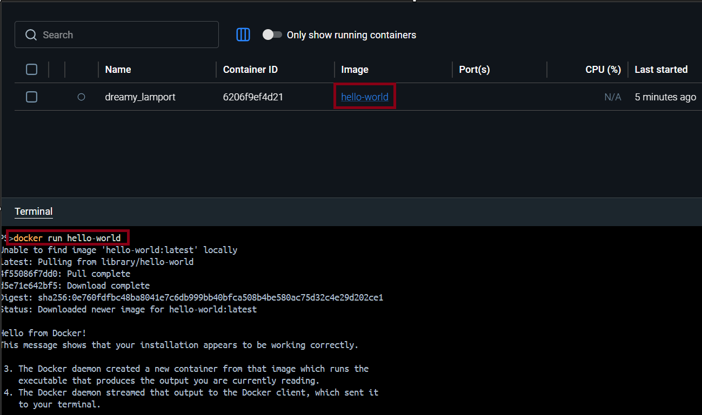

# Day 29 – Docker Basics

## Task 1: What is Docker?

### What is a Container?
A container is a lightweight, portable package that contains:

- Application code
- Runtime
- Libraries
- Dependencies
- Configuration files

Containers allow an application to run the same way on any system.

### Why Do We Need Containers?

Before containers, developers often faced:

> “It works on my machine, but not on the server.”

Different OS versions, missing dependencies, or software mismatches caused failures.

Containers solve this by packaging everything the app needs together.

### Benefits of Containers

- **Consistency** — Same environment everywhere
- **Portability** — Run on laptop, cloud, or server
- **Lightweight** — Uses fewer resources than VMs
- **Fast startup** — Starts in seconds
- **Scalability** — Easy to deploy multiple copies
- **Isolation** — Apps do not interfere with each other

### Example
A Python app needing Python 3.11 and specific libraries can run inside a container without affecting the host machine.

---

## Containers vs Virtual Machines

### Containers
- Share the host OS kernel
- Include only app and dependencies
- Lightweight and fast
- Start in seconds
- Good for microservices

### Virtual Machines (VMs)
- Emulate a complete computer system
- Include a full OS and virtual hardware
- Larger and slower to start
- Run with a hypervisor
- Provide strong isolation

### Key Difference
Containers package apps with dependencies, while VMs package an entire operating system. This makes containers more efficient for many development and cloud workflows.

---

## Docker Architecture

### Main Components

- **Docker Client** — Command-line tool users interact with
- **Docker Daemon** — Background service that manages Docker objects
- **Docker Images** — Read-only templates used to create containers
- **Docker Containers** — Running instances of images
- **Docker Registry** — Stores Docker images (e.g. Docker Hub)

### Architecture Diagram

```text
                +-------------------+
                |   Docker Client   |
                | (docker commands) |
                +---------+---------+
                          |
                          | REST API
                          v
                +-------------------+
                |   Docker Daemon   |
                |     (dockerd)     |
                +----+---------+----+
                     |         |
          manages    |         | pulls/pushes
                     v         v

            +-------------+   +----------------+
            | Containers  |   | Docker Registry|
            | Running App |   |  Docker Hub    |
            +-------------+   +----------------+

                     ^
                     |
                created from
                     |
               +-----------+
               |  Images   |
               +-----------+
```

### How It Works
1. The user runs a Docker command using the Docker Client.
2. The client sends the request to the Docker Daemon.
3. The daemon checks if the required image exists locally.
4. If not, it downloads the image from a Docker Registry.
5. The daemon creates and runs a container from that image.

---

## Task 2: Install Docker

### Installation
- Windows: Download Docker Desktop installer from the official Docker website.
- Linux: `sudo apt-get update && sudo apt-get install docker.io`

### Verify Installation
Run:

```bash
docker --version
docker run hello-world
```

### Output



### Notes
The `hello-world` container prints output directly to the terminal because it runs in the foreground by default. If you use `-d`, it would run detached instead.

---

## Task 3: Run Real Containers

### Run Nginx

```bash
docker run -d -p 80:80 nginx
```

Open `http://localhost:80` in your browser.

- `-p 80:80` maps host port `80` to container port `80`
- `-d` runs the container in detached mode

### Run Ubuntu Interactively

```bash
docker run -itd ubuntu
docker exec -it <containerId> bash
```

If you want to expose a port from Ubuntu:

```bash
docker run -itd -p 80:80 ubuntu
```

### List Running Containers

```bash
docker ps
```

### List All Containers

```bash
docker ps -a
```

### Stop and Remove a Container

```bash
docker stop <containerId> && docker rm <containerId>
```

---

## Task 4: Explore Docker Features

### Detached Mode

```bash
docker run -d nginx
```

Advantages:

- Runs in the background
- Frees the terminal immediately
- Returns a container ID
- Keeps running independently

### Custom Container Name

```bash
docker run --name mycontainer -d nginx
docker rename <containerId> <newName>
```

### Port Mapping

```bash
docker run -itd -p 80:80 ubuntu
docker run -p 80:80 nginx
```

### Container Logs

```bash
docker logs <containerId>
```

### Run a Command Inside a Running Container

```bash
docker exec -it <containerId> bash
```

This opens a shell inside the running container.
