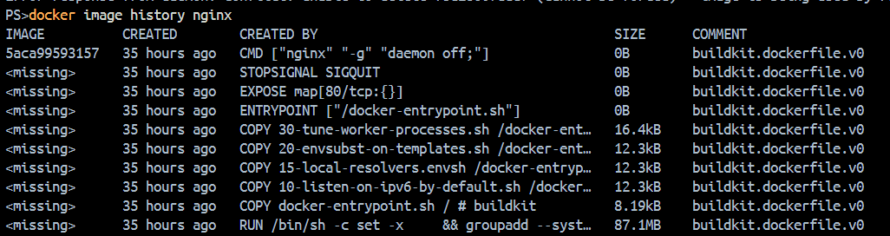

# Day 30 – Images & Containers

## Task 1: Docker Images

### 1. Pull Images

```bash
docker pull nginx
docker pull ubuntu
docker pull alpine
```

### 2. List Images

```bash
docker images
```

- Note the image names, tags, sizes, and creation times.

### 3. Compare Ubuntu vs Alpine

- `alpine` is much smaller because it is a minimal Linux distribution with only the essentials.
- `ubuntu` includes more packages and a larger base system, so its image size is bigger.

### 4. Inspect an Image

```bash
docker inspect <imageName>
```

This shows image metadata, configuration, environment variables, exposed ports, and more.

### 5. Remove an Image

```bash
docker rmi <imageId>
```

> Note: The image must not be used by any existing container.

---

## Task 2: Image Layers

### 1. View Image History

```bash
docker image history nginx
```

This shows a layer-by-layer history of the image, including:

- How the image was built
- Which commands created each layer
- Size added by each layer
- Dockerfile instructions used



### 2. Example Dockerfile

```dockerfile
FROM ubuntu
RUN apt update
RUN apt install nginx -y
COPY index.html /var/www/html
CMD ["nginx", "-g", "daemon off;"]
```

### 3. What Are Layers?

Layers are the step-by-step filesystem changes created while building an image.

Each instruction such as `RUN`, `COPY`, or `ADD` creates a new layer.

Example layer breakdown:

- Layer 1 → Ubuntu base OS
- Layer 2 → `apt update`
- Layer 3 → Install nginx
- Layer 4 → Copy website files
- Layer 5 → Startup command metadata

### 4. Why Docker Uses Layers

- Layers make image builds reusable and efficient.
- If a layer does not change, Docker can reuse it from cache.
- Layers reduce download size when multiple images share the same base layers.

---

## Task 3: Container Lifecycle

Practice the full lifecycle using one container.

### 1. Create a Container (without starting it)

```bash
docker create --name mycon -it ubuntu
```

### 2. Start the Container

```bash
docker start <containerId>
```

### 3. Pause the Container

```bash
docker pause <containerId>
```

- This freezes the container process, but the memory remains allocated.

### 4. Unpause the Container

```bash
docker unpause <containerId>
```

### 5. Stop the Container

```bash
docker stop <containerId>
```

### 6. Restart the Container

```bash
docker restart <containerId>
```

### 7. Kill the Container

```bash
docker kill <containerId>
```

- This forcefully stops the container immediately.

### 8. Remove the Container

```bash
docker rm <containerId>
```

> Check `docker ps -a` after each step to observe the state changes.

---

## Task 4: Working with Running Containers

### 1. Run Nginx in Detached Mode

```bash
docker run --name mynginx -p 80:80 -d nginx
```

### 2. View Logs

```bash
docker logs <containerId>
```

### 3. Follow Real-Time Logs

```bash
docker logs -f <containerId>
```

### 4. Exec Into the Container

```bash
docker exec -it <containerId> bash
```

If `bash` is unavailable:

```bash
docker exec -it <containerId> sh
```

### 5. Run a Single Command Inside the Container

```bash
docker exec <containerId> hostname
docker exec <containerId> ls /
```

### 6. Inspect the Container

```bash
docker inspect <containerId>
```

This reveals IP address, port mappings, mounted volumes, and container metadata.

---

## Task 5: Cleanup

### 1. Stop All Running Containers

```bash
docker stop $(docker ps -q)
```

### 2. Remove All Stopped Containers

```bash
docker container prune
```

### 3. Remove Unused Images

```bash
docker image prune
```

- Removes only dangling images.

```bash
docker image prune -a
```

- Removes all images not used by at least one container.

### 4. Check Docker Disk Usage

```bash
docker system df
```

### Cleanup Commands Summary

| Task                        | Command                       |
| --------------------------- | ----------------------------- |
| Stop all running containers | `docker stop $(docker ps -q)` |
| Remove stopped containers   | `docker container prune`      |
| Remove unused images        | `docker image prune -a`       |
| Check disk usage            | `docker system df`            |
| Full cleanup                | `docker system prune -a`      |
