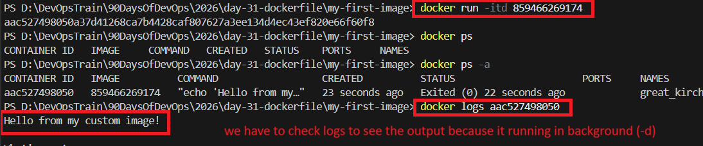

### Task 1: Your First Dockerfile

Inside the project create a `Dockerfile` that:
- **Uses** `ubuntu` as the base image
- **Installs** `curl`
- **Sets** a default command to print "Hello from my custom image!"

Dockerfile (example):

```dockerfile
# Use Ubuntu base image
FROM ubuntu:latest

# Set working directory
WORKDIR /app

# Install curl
RUN apt-get update && apt-get install -y curl && rm -rf /var/lib/apt/lists/*

# Default command
CMD ["echo", "Hello from my custom image!"]
```



### Task 2: Dockerfile Instructions
Create a Dockerfile that demonstrates these instructions (all commands should be bolded when referenced):

- **FROM** — base image
- **RUN** — execute commands during build (e.g., install packages)
- **WORKDIR** — set working directory
- **COPY** — copy files from host to image
- **EXPOSE** — document the port (annotation only)
- **CMD** — default command

Example Dockerfile:

```dockerfile
FROM ubuntu:latest
WORKDIR /app
COPY . /app
RUN apt-get update && apt-get install -y nginx || true
EXPOSE 80
CMD ["/bin/bash", "-c", "ls -la && pwd && echo 'demo' "]
```

### Task 3: CMD vs ENTRYPOINT

1. **CMD example** — `CMD ["echo","hello"]`

Behavior: **CMD** is overridden when a different command is passed to `docker run`.

Example:

```dockerfile
FROM ubuntu
CMD ["echo", "hello"]
```

Build & run:

```bash
docker build -t cmd-image:v1 .
docker run --rm cmd-image:v1         # prints: hello
docker run --rm cmd-image:v1 ls     # runs: ls (CMD is replaced)
```

2. **ENTRYPOINT example** — `ENTRYPOINT ["echo"]`

Behavior: **ENTRYPOINT** sets the executable; arguments passed to `docker run` are appended.

Example:

```dockerfile
FROM ubuntu
ENTRYPOINT ["echo"]
```

```bash
docker build -t entry-image:v1 .
docker run --rm entry-image:v1            # no output (no args)
docker run --rm entry-image:v1 Devendra    # prints: Devendra
```

3. **When to use which**

- Use **CMD** when you want a default command that can be easily overridden.
- Use **ENTRYPOINT** when you want a fixed executable and allow arguments to be passed.
- You can combine them: `ENTRYPOINT ["ping"]` with `CMD ["google.com"]` sets a default argument that can be replaced by `docker run`.


### Task 4: Build a Simple Web App Image

Example Dockerfile (serve static files with nginx):

```dockerfile
FROM nginx:alpine
WORKDIR /app
COPY . /usr/share/nginx/html/
EXPOSE 80
```

# Usage

```bash
docker build -t simple-web:latest .
docker run -d -p 80:80 simple-web:latest
```


### Task 5: .dockerignore

Create a `.dockerignore` to exclude unnecessary files from the build context.

Example `.dockerignore`:

```
node_modules
.git
*.md
.env
```

Build the image and verify the ignored files are not included in the final image.