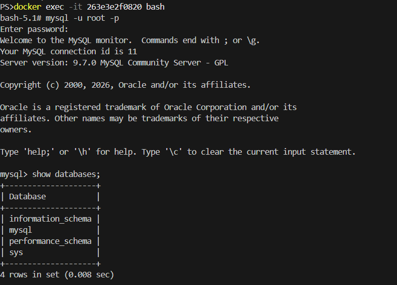
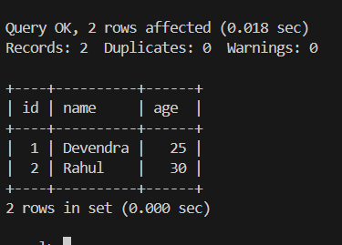
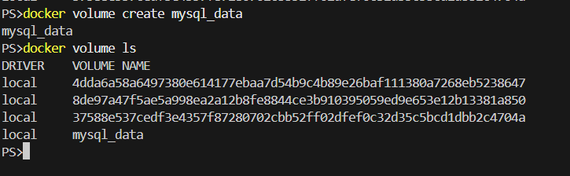
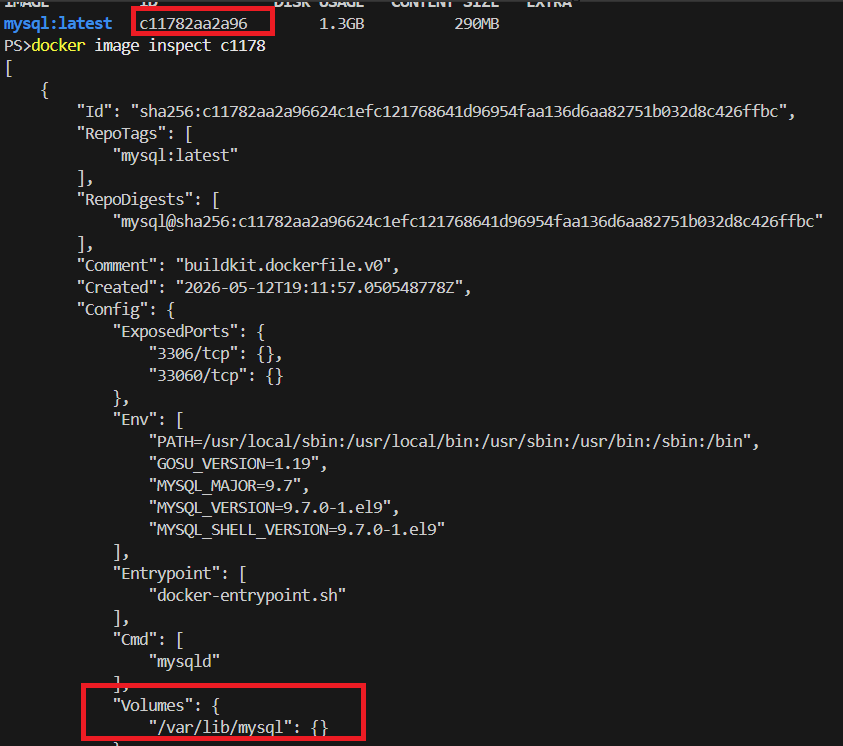
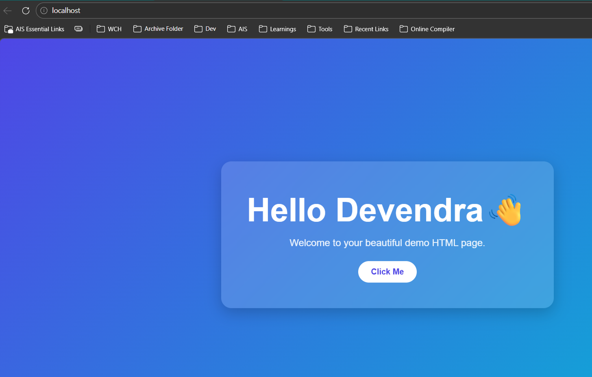
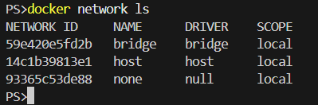
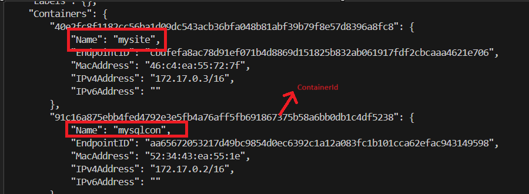
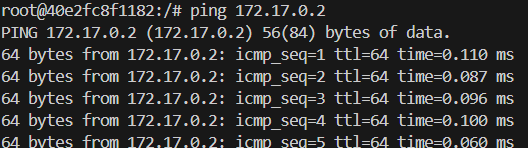
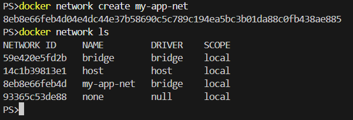
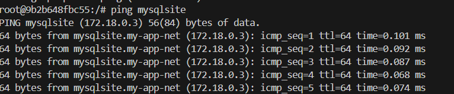

## Task 1: The Problem (Data Persistence)

### Step 1: Run a MySQL Container

```bash
docker run --name mysqlcontain -e MYSQL_ROOT_PASSWORD=Test@123 -d mysql
```

### Step 2: Create Data in MySQL

Login to the container:

```bash
docker exec -it <containerId> mysql -u root -p
```

Create a database and table:

```sql
CREATE DATABASE demo_db;
USE demo_db;

CREATE TABLE users (
    id INT PRIMARY KEY AUTO_INCREMENT,
    name VARCHAR(50),
    age INT
);

INSERT INTO users (name, age)
VALUES
('Devendra', 25),
('Rahul', 30);

SELECT * FROM users;
```



### Step 3: Stop and Remove the Container

```bash
docker stop <containerId>
docker rm <containerId>
```

### Step 4: Run a New Container

**Problem:** All data is **LOST**!

Containers are **ephemeral** in nature. When they are stopped or removed, all data inside is lost. To persist data, we need external storage (volumes).



## Task 2: Named Volumes (Persistent Storage)

### Step 1: Create a Named Volume

```bash
docker volume create mysql_data
docker volume ls
```

> **Note:** You can also use any folder path as a volume on your local machine (Windows/Linux).



To inspect the volume mount point on the MySQL container:

```bash
docker image inspect <imageId>
```

Look for the **Volumes** section.



### Step 2: Run Container with Named Volume

```bash
docker run --name mysqlcon -v mysql_data:/var/lib/mysql -it -e MYSQL_ROOT_PASSWORD=Test@123 -d mysql
```

### Step 3: Add Data, Then Stop and Remove

```bash
docker stop <containerId>
docker rm <containerId>
```

### Step 4: Run a New Container with the Same Volume

```bash
docker run --name mysqlcon -v mysql_data:/var/lib/mysql -it -e MYSQL_ROOT_PASSWORD=Test@123 -d mysql
```

### Step 5: Data Persistence

✅ **Yes, the data is still present!**

Data persists after deleting and recreating the container because it is stored in the named volume.


## Task 3: Bind Mounts (Live Development)

### Step 1: Create a Folder with index.html

Create the folder structure:

```
D:\DevOpsTrain\90DaysOfDevOps\2026\day-32-dockerVolumes-Network\bind\index.html
```

### Step 2: Run Nginx with Bind Mount

```bash
docker run --name mysite -v D:\DevOpsTrain\90DaysOfDevOps\2026\day-32-dockerVolumes-Network\bind\:/usr/share/nginx/html/ -p 80:80 -d nginx
```

### Step 3: Access the Page

Open your browser and navigate to `http://localhost`.


### Step 4: Edit and Live Refresh

Edit `index.html` on your host machine (add "Hello Devendra").

**No need to restart the container!** Simply refresh the browser to see the changes.

> **Note:** Any changes made to the bind mount folder are immediately reflected in the running container.



### Named Volumes vs Bind Mounts

| Feature | Named Volume | Bind Mount |
|---------|--------------|---------------|
| **Managed by Docker** | ✅ Yes | ❌ No |
| **Storage Location** | Docker-managed directory | Any host directory |
| **Easier to use** | ✅ Yes | Medium |
| **Performance** | Better for Docker workloads | Depends on host filesystem |
| **Host path required** | ❌ No | ✅ Yes |
| **Portable** | More portable | Less portable |
| **Best for** | Databases, persistent app data | Source code, configs, development |
| **Backup/Migration** | Easier with Docker commands | Manual |
| **Security** | More isolated | Direct host access |


## Task 4: Docker Networking Basics

### Step 1: List All Docker Networks

```bash
docker network ls
```



### Step 2: Inspect the Default Bridge Network

```bash
docker network inspect <networkId>
```

> **Note:** Check the **containers** section to see which containers are attached. Containers are isolated by default and can only communicate if they are on the same network.



### Step 3: Ping by Container Name (Default Bridge)

Login to the nginx container:

```bash
docker exec -it <containerId> bash
```

Install ping utility:

```bash
apt update && apt install -y iputils-ping
```

❌ **Ping by name does NOT work on the default bridge network.**

Reason: **DNS capabilities are limited in the default bridge network**. This will work with custom networks.

### Step 4: Ping by IP Address (Default Bridge)

```bash
ping <container_ip>
```

✅ **Ping by IP works** on the default bridge.




## Task 5: Custom Networks (Service Discovery)

### Step 1: Create a Custom Bridge Network

```bash
docker network create my-app-net
```



### Step 2: Run Containers on the Custom Network

```bash
docker run --name mysite --network my-app-net -itd nginx
docker run --name mysqlsite --network my-app-net -e MYSQL_ROOT_PASSWORD=Test@123 -d mysql
```

### Step 3: Verify Containers on the Network

```bash
docker network inspect my-app-net
```

Both containers should be visible in the output.

### Step 4: Ping by Container Name (Custom Network)

Login to the nginx container:

```bash
docker exec -it <containerId> bash
```

Install ping if needed:

```bash
apt update && apt install -y iputils-ping
```

Ping by container name:

```bash
ping mysqlsite
```

✅ **Ping by name works on custom networks!**



### Why Custom Networks Allow Name-Based Communication

**Custom bridge networks have built-in DNS resolution**, allowing containers to discover each other by name. The default bridge network has limited DNS capabilities for container-to-container communication. Custom networks provide a more isolated and service-discovery-friendly environment for multi-container applications.