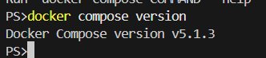
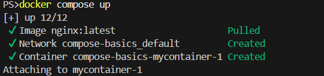
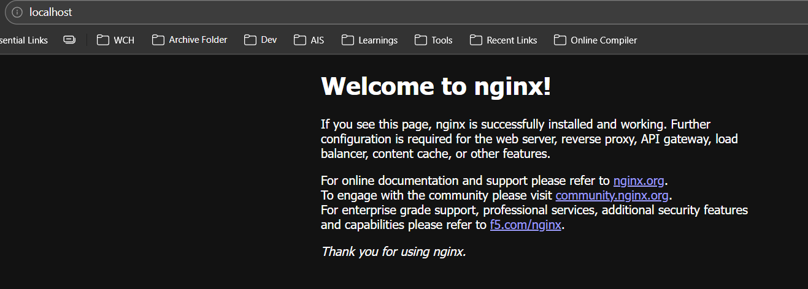
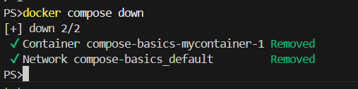
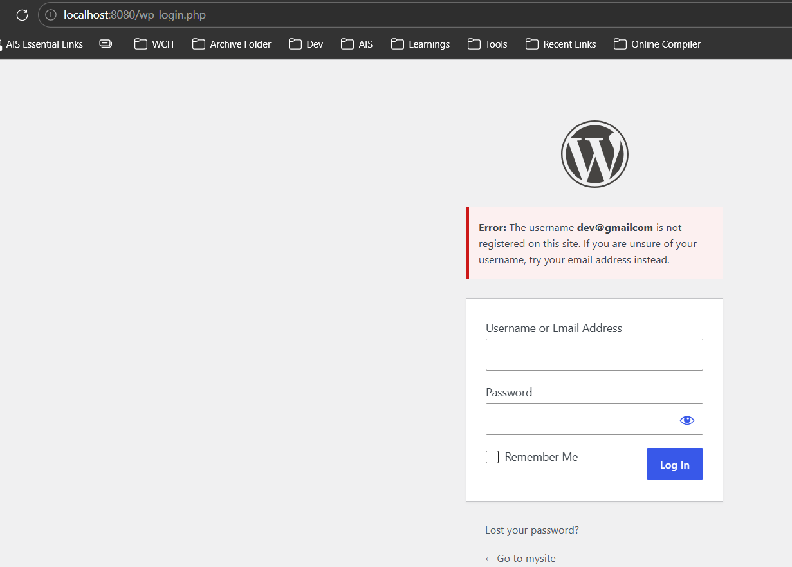

## Task 1: Install & Verify

1. **Check if Docker Compose is available** on your machine
2. **Verify the version**:

```bash
docker compose --version
```



## Task 2: Your First Compose File

### Step 1: Create Project Folder

```bash
mkdir compose-basics
cd compose-basics
```

### Step 2: Create docker-compose.yml

Create a `docker-compose.yml` file to run a single Nginx container with port mapping:

```yaml
services:
  mycontainer:
    image: nginx:latest
    ports:
      - "80:80"
```

### Step 3: Start Services

```bash
docker compose up
```



### Step 4: Access in Browser

Open your browser and navigate to `http://localhost`.



### Step 5: Stop Services

```bash
docker compose down
```



## Task 3: Two-Container Setup

Write a `docker-compose.yml` that runs:
- A **WordPress** container
- A **MySQL** container

Example `docker-compose.yml`:

```yaml
services:
  mysql:
    image: mysql:5.7
    environment:
      MYSQL_ROOT_PASSWORD: example
      MYSQL_DATABASE: wordpress
    ports:
      - "3306:3306"

  wordpress:
    image: wordpress:latest
    environment:
      WORDPRESS_DB_HOST: mysql
      WORDPRESS_DB_NAME: wordpress
      WORDPRESS_DB_USER: root
      WORDPRESS_DB_PASSWORD: example
    ports:
      - "8080:80"
    depends_on:
      - mysql
```



## Task 4: Docker Compose Commands

### 1. Start Services in Detached Mode

```bash
docker compose up -d
```

### 2. View Running Services

```bash
docker compose ps
```

### 3. View Logs of All Services

```bash
docker compose logs
```

### 4. View Logs of a Specific Service

```bash
docker compose logs <serviceName>
```

> **Note:** Service names can be found in the `SERVICE` column of `docker compose ps` output.

### 5. Stop Services Without Removing

```bash
docker compose stop
```

> **Note:** This does NOT delete the containers. Use `docker compose start` to restart them.

To delete containers completely:

```bash
docker compose down
```

### 6. Remove Everything (Containers, Networks, Volumes, Images)

```bash
docker compose down -v --rmi all
```

Flags:
- **-v**: Remove volumes
- **--rmi all**: Remove all images

### 7. Rebuild Images After Changes

```bash
docker compose up --build
```

Use this when you modify:
- `Dockerfile`
- Application code
- Dependencies

## Task 5: Environment Variables

### Option 1: Variables Directly in docker-compose.yml

```yaml
services:
  myapp:
    image: nginx:latest
    environment:
      ENV_VAR_1: value1
      ENV_VAR_2: value2
```

### Option 2: Variables from .env File

Create a `.env` file in the same directory as `docker-compose.yml`:

```
ENV_VAR_1=value1
ENV_VAR_2=value2
DB_PASSWORD=secret123
```

Reference in `docker-compose.yml`:

```yaml
services:
  myapp:
    image: nginx:latest
    environment:
      ENV_VAR_1: ${ENV_VAR_1}
      ENV_VAR_2: ${ENV_VAR_2}
      DB_PASSWORD: ${DB_PASSWORD}
```

### Verify Variables Are Being Used

```bash
docker compose config
```

This displays the resolved configuration with all variables substituted.