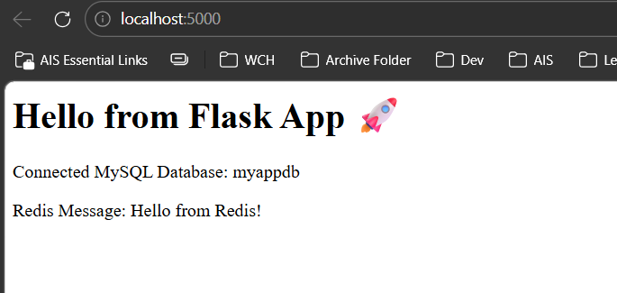

## Task 1: Build Your Own App Stack

Create a `docker-compose.yml` for a 3-service stack with:
- A **web app** (Python Flask, Node.js, or any language you know)
- A **database** (Postgres or MySQL)
- A **cache** (Redis)

Write a simple `Dockerfile` for the web app. The app can be a basic "Hello World" that connects to the database.

## Task 2: `depends_on` & Healthchecks

1. Add `depends_on:` to your compose file so the app starts **after** the database.
2. Add a **healthcheck** to the database service.
3. Use `depends_on:` with `condition: service_healthy` so the app waits until the database is truly ready, not just started.

**Test:** Bring everything down and up — verify the app waits for the DB.



## Task 3: Restart Policies

1. Add `restart: always` to your database service.
2. Manually kill the database container — does it come back?
3. Try `restart: on-failure` — how is it different?
4. Write in your notes: When would you use each restart policy?

### Restart Policy Behavior

The core difference depends on the container exit code.

- **`always`**: Docker restarts the container regardless of why it stopped. This includes crashes (`Exit Code 1`), manual stops, or clean exits (`Exit Code 0`).
- **`on-failure`**: Docker restarts the container only if it exits with a non-zero code. A clean exit (`Exit Code 0`) is not restarted.

| Policy | Behavior | Best Used For |
| :--- | :--- | :--- |
| **`no`** *(default)* | Docker will never restart the container automatically. | One-off debugging tasks; short-lived scripts or migrations. |
| **`always`** | Docker restarts the container regardless of exit status, and restarts it when the daemon restarts. | Databases (`MySQL`, `Postgres`), caches (`Redis`), and always-on services. |
| **`on-failure`** | Docker restarts the container only if it exits with an error (non-zero exit code). | Migration scripts, one-time tasks, or workers that should stop after success. |
| **`unless-stopped`** | Similar to `always`, but does not restart if manually stopped. | Production services where you want uptime but also manual maintenance control. |

## Task 4: Custom Dockerfiles in Compose

1. Use `build:` in your compose file instead of a pre-built image.
2. Make a code change in your app.
3. Rebuild and restart with one command.

Example:

```yaml
services:
  app:
    build: ./app
    ports:
      - "5000:5000"
```

Then run:

```bash
docker compose up --build
```

## Task 5: Named Networks & Volumes

1. Define **explicit networks** in your compose file instead of relying on the default network.
2. Define **named volumes** for database data.
3. Add **labels** to your services for better organization.

Example:

```yaml
services:
  db:
    image: postgres:latest
    volumes:
      - pgdata:/var/lib/postgresql/data
    networks:
      - app-net
    labels:
      - "project=demo"

networks:
  app-net:
    driver: bridge

volumes:
  pgdata:
```

## Task 6: Scaling (Bonus)

1. Try scaling your web app to 3 replicas using `docker compose up --scale`.

> Note: Scaling fails if the service has a custom `container_name` because each container must have a unique name.

2. What happens? What breaks?

- Docker can create the first instance successfully.
- The second and third instances fail because they attempt to bind the same host port.

3. Why doesn't simple scaling work with port mapping?

- When you map a container port to a host port, only one container can use that host port at a time.
- Example error:

```text
driver failed programming external connectivity on endpoint myapp-2: Bind for 0.0.0.0:5000 failed: port is already allocated
```

### What breaks

- `myapp-1` starts and claims host port `5000`.
- `myapp-2` and `myapp-3` fail because they also try to use host port `5000`.

### Fixes for scaling

- Remove `container_name` from the service.
- Avoid binding the same host port for each replica.
- Use a load balancer or reverse proxy if you need multiple instances behind one host port.
