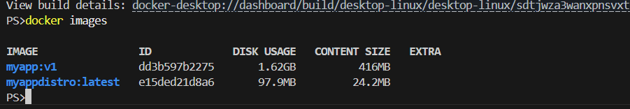
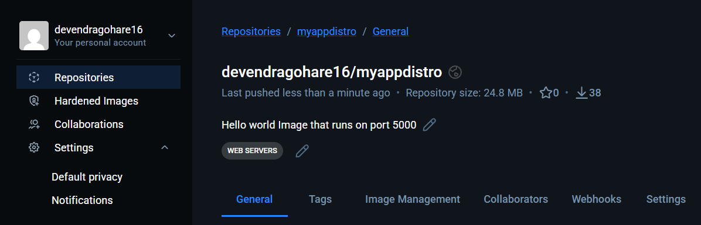

### Task 1: The Problem with Large Images
1. Write a simple Go, Java, or Node.js app (even a "Hello World" is fine)
2. Create a Dockerfile that builds and runs it in a **single stage**
3. Build the image and check its **size**

Note down the size — you'll compare it later.

Taking the same application used in day-34.
image used - python:3.11
image size - 1.6 Gb

### Task 2: Multi-Stage Build
1. Rewrite the Dockerfile using **multi-stage build**:
   - Stage 1: Build the app (install dependencies, compile)
   - Stage 2: Copy only the built artifact into a minimal base image (`alpine`, `distroless`, or `scratch`)
2. Build the image and check its size again
3. Compare the two sizes

distroless image size is 97.9 MB only

Write in your notes: Why is the multi-stage image so much smaller?
because it does not additonal things that general distribution has eg - Terminal/ shell, it only contains packages that needed to run the application. it is also more secure.

### Task 3: Push to Docker Hub
1. Create a free account on [Docker Hub](https://hub.docker.com) (if you don't have one)
2. Log in from your terminal
3. Tag your image properly: `yourusername/image-name:tag`
   
   docker login
   docker tag  myappdistro:latest devendragohare16/myappdistro:latest (docker tag image-name tagged-image-name)
   docker push devendragohare16/myappdistro:latest

4. Push it to Docker Hub
5. Pull it on a different machine (or after removing locally) to verify

### Task 4: Docker Hub Repository
1. Go to Docker Hub and check your pushed image
2. Add a **description** to the repository
3. Explore the **tags** tab — understand how versioning works
4. Pull a specific tag vs `latest` — what happens?

### Task 5: Image Best Practices
Apply these to one of your images and rebuild:
1. Use a **minimal base image** (alpine vs ubuntu — compare sizes)
2. **Don't run as root** — add a non-root USER in your Dockerfile
# ... (your builder stage stays the same) ...

# 2. Deployer Stage
FROM gcr.io/distroless/python3-debian12 AS deployer

WORKDIR /distro_app

# Copy only the installed packages from the builder
COPY --from=builder /app/library /distro_app/library

# Copy ONLY your source code files
COPY --from=builder /app /distro_app

# Set the Python path so it knows where to find the libraries
ENV PYTHONPATH=/distro_app/library

# -------------------------------------------------------------
# SECURITY BEST PRACTICE: Switch to the built-in nonroot user
# -------------------------------------------------------------
USER nonroot

EXPOSE 5000

# Distroless already has 'python' as the entrypoint. 
CMD ["app.py"]

Distroless images already come pre-configured with a non-root user named nonroot (UID 65532) built right into them.

Why the order matters
Notice how USER nonroot is placed after the COPY commands.

Root is needed for setup: The COPY --from=builder commands need root privileges to write files into /distro_app.

Drop privileges before running: Once all the files are safely copied into the container, you switch to USER nonroot. From that point forward, anything the container executes (like your app.py script) will run with restricted permissions.

One important thing to watch out for
Because your app now runs as nonroot, it won't have permission to write files to root-owned directories. If your app.py needs to write logs, upload files, or create a local SQLite database, you will need to change the ownership of that specific folder before switching users.

For example, if you needed a writable logs directory, you would add this right before switching users:

# If you need a directory your app can write to:
# (Run as root to change ownership to the nonroot user UID/GID)
COPY --chown=65532:65532 ./logs /distro_app/logs
USER nonroot

3. Combine `RUN` commands to **reduce layers**
4. Use **specific tags** for base images (not `latest`)