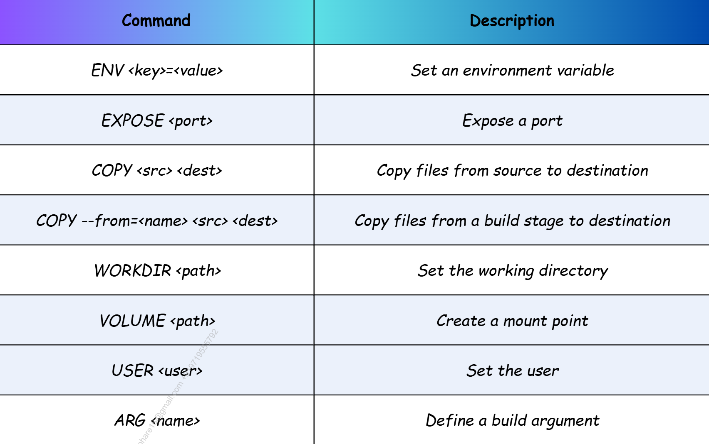
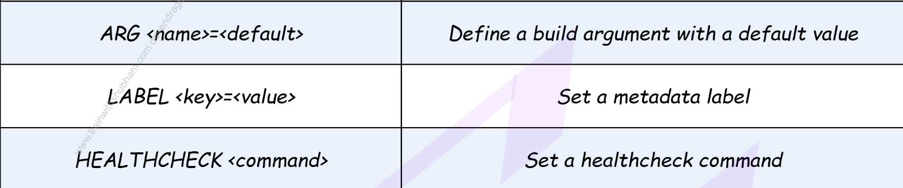

# Docker Cheat Sheet

## Container Commands
* `docker run -d --name <name> -p <host>:<container> <image>` — Run a container in the background with mapped ports.
* `docker ps -a` — List all containers (both running and stopped).
* `docker stop <container>` — Gracefully stop a running container.
* `docker rm -f <container>` — Force-remove a container (even if running).
* `docker exec -it <container> /bin/sh` — Open an interactive shell inside a running container.
* `docker logs -f --tail 100 <container>` — Follow a container's logs, showing the last 100 lines.
* `docker inspect <container>` — View detailed low-level JSON configuration of a container.

## Image Commands
* `docker build --no-cache --progress=plain -t <name>:<tag> .` — Build an image from a Dockerfile with full raw output.
* `docker pull <image>:<tag>` — Download an image from a registry (like Docker Hub).
* `docker push <image>:<tag>` — Upload an image to a registry.
* `docker tag <source_image> <target_image>:<tag>` — Create a shortcut tag pointing to an existing image.
* `docker image ls` — List all locally stored images.
* `docker rmi <image>` — Remove a local image.
* `docker history <image>` — Show the layers and history of how an image was built.

## Volume Commands
* `docker volume create <volume_name>` — Create a persistent named volume.
* `docker volume ls` — List all locally managed volumes.
* `docker volume inspect <volume_name>` — View host storage path and metadata of a volume.
* `docker volume rm <volume_name>` — Delete a specific volume (fails if attached to a container).

## Network Commands
* `docker network create --driver bridge <net_name>` — Create a custom network for container communication.
* `docker network ls` — List all available Docker networks on the host.
* `docker network inspect <net_name>` — See connected containers and internal IP subnets.
* `docker network connect <net_name> <container>` — Connect an existing container to a specific network.
* `docker network disconnect <net_name> <container>` — Disconnect an existing container from specific network.

## Compose Commands
* `docker compose up -d` — Start all services in the background defined in `docker-compose.yml`.
* `docker compose down -v` — Stop services and cleanly remove containers, networks, and volumes.
* `docker compose ps` — List status of containers managed by the current Compose file.
* `docker compose logs -f <service>` — Follow logs for a specific service.
* `docker compose build --no-cache` — Rebuild images for services defined in the file from scratch.

## Cleanup Commands
* `docker system df` — Check how much disk space Docker is utilizing across all objects.
* `docker system prune -a --volumes` — Nuclear option: delete all stopped containers, unused networks, dangling/unused images, and volumes.

## Dockerfile Instructions
* `FROM <image>:<tag>` — Sets the base image to build upon (always use specific tags, not `latest`).
* `RUN <command>` — Executes a shell command during the build phase to install dependencies and create layers.
* `COPY <src> <dest>` — Copies local files/directories from the host machine into the image.
* `WORKDIR /path` — Sets the absolute working directory for subsequent instructions (creates it if missing).
* `EXPOSE <port>` — Informational annotation indicating which port the application listens on at runtime.
* `CMD ["args"]` — Default arguments passed to the entrypoint executable; overridden by runtime arguments.
* `ENTRYPOINT ["executable"]` — Configures the main command that will execute when the container boots up.

