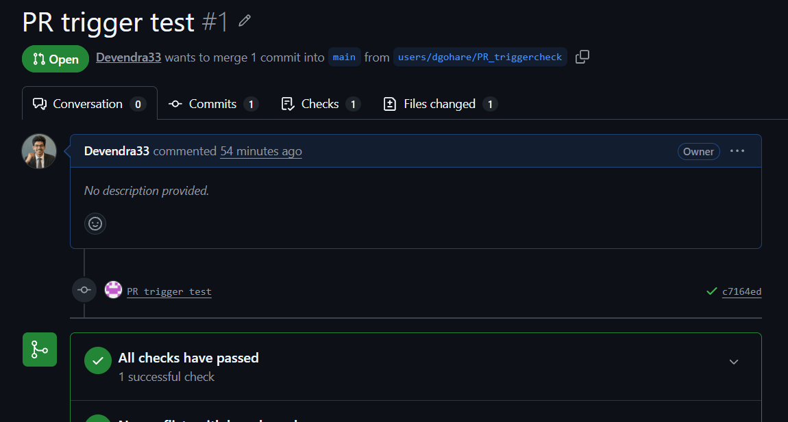
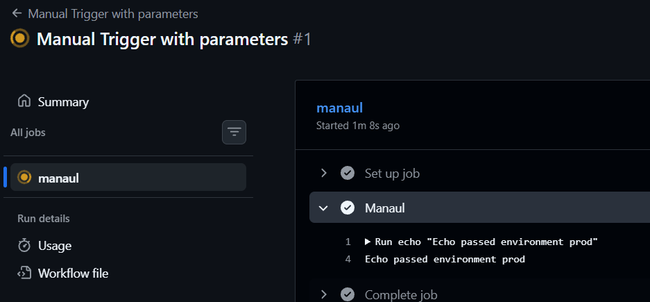
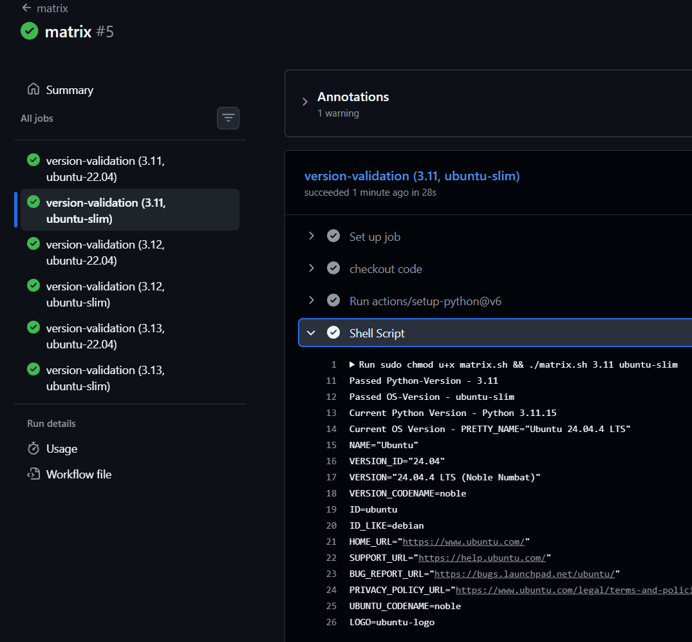
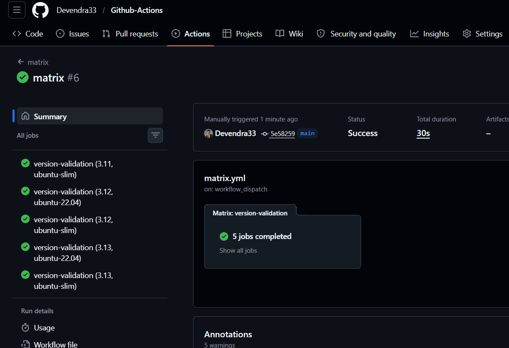

### Task 1 — Trigger on Pull Request

Steps performed:
1. Created `.github/workflows/pr-check.yml`.
2. Configured it to trigger only when a pull request is opened or updated against `main`.
3. Added a step that prints the branch name: `PR check running for branch: <branch name>`.
4. Created a branch, pushed a commit, and opened a PR.
5. Verified the workflow runs automatically.

**Verify:** The workflow run appears on the PR page (screenshot below).



Example trigger snippet used in `pr-check.yml`:
```yaml
on:
  pull_request:
    branches: [ main ]
    types: [ opened, synchronize, reopened ]
```

---

### Task 2 — Scheduled Trigger

Steps:
1. Added a `schedule:` trigger using cron syntax.
2. Set it to run every day at midnight UTC.

Cron used (daily at 00:00 UTC):
```yaml
on:
  schedule:
    - cron: '0 0 * * *'
```

Question: What is the cron expression for every Monday at 9:00 AM UTC?

Answer: `0 9 * * 1`

Tip: Use Crontab Guru (https://crontab.guru) to build and verify cron expressions.

---

### Task 3 — Manual Trigger (`workflow_dispatch`)

Steps:
1. Created `.github/workflows/manual.yml` with a `workflow_dispatch` trigger.
2. Added an input named `environment` with allowed values like `staging` and `production`.
3. Added a step that echoes the selected input.
4. Triggered the workflow manually from the Actions tab and confirmed the input was printed.

Example `workflow_dispatch` snippet:
```yaml
on:
  workflow_dispatch:
    inputs:
      environment:
        description: 'Target environment'
        required: true
        default: 'staging'
```

Screenshot: manual run with `prod` selected.



---

### Task 4 — Matrix Builds

What I implemented:
1. Created `.github/workflows/matrix.yml` that uses a matrix strategy for Python versions `3.10`, `3.11`, `3.12`.
2. Each job installs Python and prints its version.
3. Verified the three jobs run in parallel.

Basic matrix example:
```yaml
strategy:
  matrix:
    python-version: [ '3.10', '3.11', '3.12' ]
```

If you extend the matrix to include 2 operating systems (for example `ubuntu-latest` and `windows-latest`), total jobs = 3 Python versions × 2 OS = **6 jobs** (before exclusions).

Screenshot: matrix runs (example).



---

### Task 5 — Exclude & Fail-Fast

What I did:
1. Excluded a specific combination from the matrix (e.g., Python 3.10 on Windows) using the `exclude` block.
2. Set `fail-fast: false` and triggered a failing job to observe behavior.

Result: The excluded combination was skipped, so fewer jobs ran (example: 5 jobs ran when one combination was excluded).

Example of excluding a matrix combination:
```yaml
strategy:
  fail-fast: false
  matrix:
    os: [ ubuntu-22.04, windows-latest ]
    python-version: [ '3.10', '3.11', '3.12' ]
    exclude:
      - os: windows-latest
        python-version: '3.10'
```

What `fail-fast` does:
- `fail-fast: true` (default): when one matrix job fails, GitHub cancels the remaining jobs in that matrix — gives faster feedback and saves runner minutes.
- `fail-fast: false`: all matrix jobs continue even if some fail — useful to see the full set of failures across combinations before fixing.

Screenshot: excluded combination and example failure behavior.

